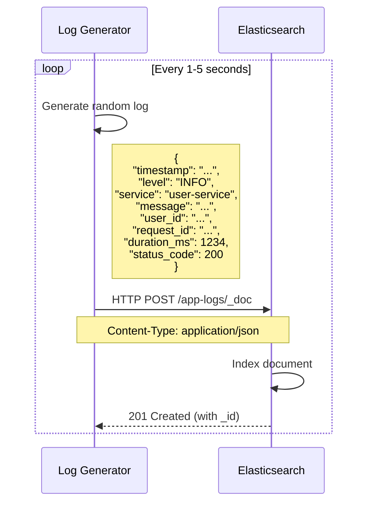
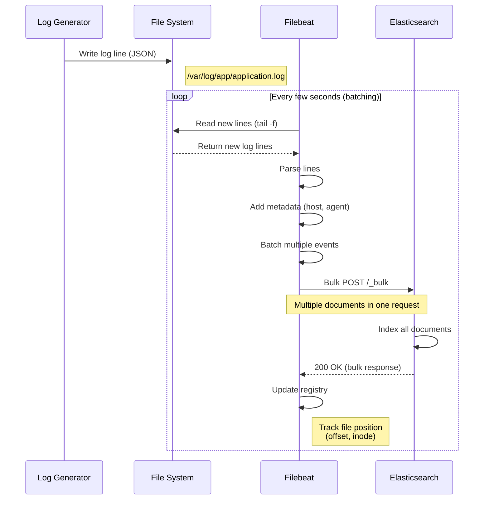
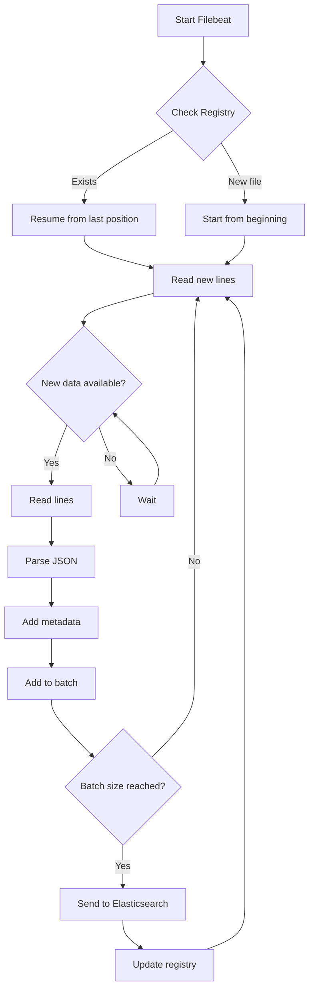
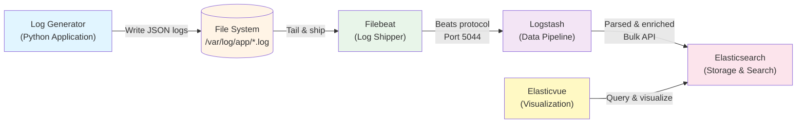
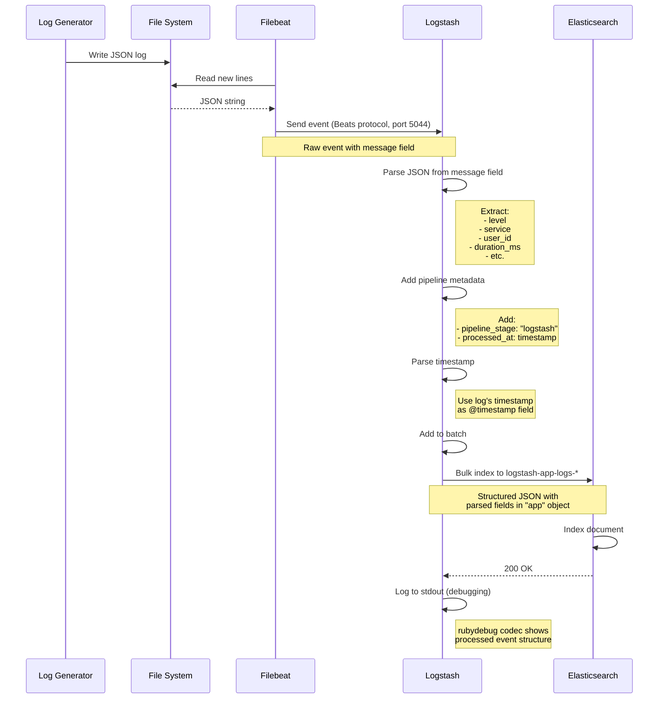
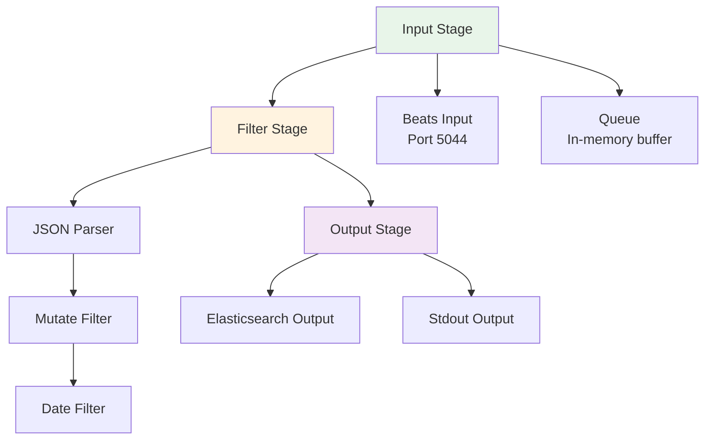

# ELK Demo Architecture Evolution

This document explains the evolution of our logging architecture through three phases, detailing how each component works, why changes were made, and the benefits of each approach.

---

## Table of Contents

1. [Phase 1: Direct Elasticsearch Integration](#phase-1-direct-elasticsearch-integration)
2. [Phase 2: Filebeat Integration](#phase-2-filebeat-integration)
3. [Phase 3: Complete ELK Stack with Logstash](#phase-3-complete-elk-stack-with-logstash)
4. [Comparison Matrix](#comparison-matrix)
5. [Best Practices & Lessons Learned](#best-practices--lessons-learned)

---

## Phase 1: Direct Elasticsearch Integration

### Overview
The simplest approach where the application sends logs directly to Elasticsearch via HTTP API.

### Architecture Diagram


### Sequence Diagram



### Implementation Details

#### Log Generator (`log-generator/app.py`)
```python
def send_log_to_elasticsearch(log_entry):
    """Send log directly to Elasticsearch HTTP API"""
    try:
        response = requests.post(
            f"{ELASTICSEARCH_URL}/app-logs/_doc",
            json=log_entry,
            headers={"Content-Type": "application/json"}
        )
        response.raise_for_status()
        print(f"✓ Log sent: {log_entry['level']} - {log_entry['service']}")
    except requests.exceptions.RequestException as e:
        print(f"✗ Failed to send log: {e}")
```

#### Docker Compose Configuration
```yaml
services:
  elasticsearch:
    image: docker.elastic.co/elasticsearch/elasticsearch:8.19.0
    ports:
      - "9200:9200"
    environment:
      - discovery.type=single-node
      - xpack.security.enabled=false
  
  log-generator:
    build: ./log-generator
    depends_on:
      - elasticsearch
    environment:
      - ELASTICSEARCH_URL=http://elasticsearch:9200
```

### Data Storage

| Field | Type | Description |
|-------|------|-------------|
| `timestamp` | date | ISO8601 timestamp |
| `level` | keyword | Log level (INFO, WARNING, ERROR, DEBUG) |
| `service` | keyword | Service name (user-service, payment-service, etc.) |
| `message` | text | Log message |
| `user_id` | keyword | User identifier |
| `request_id` | keyword | Request trace ID |
| `duration_ms` | long | Request duration in milliseconds |
| `status_code` | integer | HTTP status code |

### Advantages ✅

1. **Simplicity**: Direct HTTP API calls, no middleware
2. **Low Latency**: Immediate indexing
3. **Easy Setup**: Only 2 containers needed
4. **Simple Debugging**: Direct connection makes troubleshooting straightforward

### Disadvantages ❌

1. **Tight Coupling**: Application directly depends on Elasticsearch availability
2. **No Buffering**: If Elasticsearch is down, logs are lost
3. **Network Overhead**: Each log = one HTTP request
4. **No Transformation**: Can't enrich or parse logs before indexing
5. **Scalability Issues**: Application performance affected by Elasticsearch speed
6. **Security Risk**: Direct exposure of Elasticsearch to applications

### When to Use

- **Development/Testing**: Quick prototypes and local testing
- **Small Applications**: Low-volume logging (<1000 logs/day)
- **Simple Requirements**: No need for log processing or buffering

---

## Phase 2: Filebeat Integration

### Overview
Introducing Filebeat as a lightweight log shipper to decouple the application from Elasticsearch. The application writes logs to files, and Filebeat tails these files and ships them to Elasticsearch.

### Architecture Diagram


### Sequence Diagram



### Why This Change?

#### Problems Solved

1. **Decoupling**: Application no longer depends on Elasticsearch availability
2. **Resilience**: Logs persist in files even if Elasticsearch is down
3. **Performance**: Application writes to local disk (fast) instead of network calls
4. **Buffering**: Filebeat handles retries and backpressure
5. **Production Pattern**: Industry-standard approach for log collection

### Implementation Changes

#### 1. Log Generator Changes

**Before (Phase 1):**
```python
def send_log_to_elasticsearch(log_entry):
    response = requests.post(
        f"{ELASTICSEARCH_URL}/app-logs/_doc",
        json=log_entry
    )
```

**After (Phase 2):**
```python
def write_log_to_file(log_entry):
    """Write log to file in JSON format (one line per log)"""
    log_file = "/var/log/app/application.log"
    with open(log_file, "a") as f:
        f.write(json.dumps(log_entry) + "\n")
    print(f"✓ Log written: {log_entry['level']} - {log_entry['service']}")
```

**Key Differences:**
- Network call → File I/O (much faster)
- No error handling for Elasticsearch needed
- Logs persisted immediately
- No dependency on Elasticsearch uptime

#### 2. Filebeat Configuration (`filebeat/filebeat.yml`)

```yaml
filebeat.inputs:
  - type: filestream
    id: app-logs
    enabled: true
    paths:
      - /var/log/app/*.log
    fields:
      log_source: filebeat
    fields_under_root: true

output.elasticsearch:
  hosts: ["elasticsearch:9200"]
  index: "filebeat-app-logs-%{+yyyy.MM.dd}"
  
setup.ilm.enabled: false
setup.template.name: "filebeat-app-logs"
setup.template.pattern: "filebeat-app-logs-*"
```

**Configuration Breakdown:**

| Setting | Purpose |
|---------|---------|
| `type: filestream` | Modern file input (replaces deprecated `log` type) |
| `paths` | Glob pattern for log files to monitor |
| `fields` | Add custom metadata to each event |
| `output.elasticsearch` | Where to send logs |
| `index` | Custom index pattern with date |
| `setup.ilm.enabled: false` | Disable Index Lifecycle Management for simplicity |

#### 3. Docker Compose Changes

```yaml
services:
  log-generator:
    volumes:
      - app-logs:/var/log/app  # Shared volume for log files
    # Removed: ELASTICSEARCH_URL environment variable
  
  filebeat:
    image: docker.elastic.co/beats/filebeat:8.19.0
    volumes:
      - ./filebeat/filebeat.yml:/usr/share/filebeat/filebeat.yml:ro
      - app-logs:/var/log/app:ro  # Read-only access to log files
      - filebeat-data:/usr/share/filebeat/data  # Registry persistence
    depends_on:
      - elasticsearch

volumes:
  app-logs:  # Shared between log-generator and filebeat
  filebeat-data:  # Persists file positions
```

### How Filebeat Works

#### 1. File Tailing Mechanism



#### 2. Registry File

Filebeat maintains a registry to track:
- **File paths**: Which files are being monitored
- **Inodes**: File system identifiers (handles file rotation)
- **Offsets**: Current read position in each file
- **Timestamps**: Last modification times

**Registry Location:** `/usr/share/filebeat/data/registry/filebeat/`

**Example Registry Entry:**
```json
{
  "source": "/var/log/app/application.log",
  "offset": 123456,
  "timestamp": "2026-01-15T10:30:00Z",
  "ttl": -1,
  "type": "filestream",
  "id": "native::12345678-inode",
  "prev_id": ""
}
```

#### 3. Batching and Performance

| Metric | Value | Description |
|--------|-------|-------------|
| **Default Batch Size** | 50 events | Events collected before sending |
| **Batch Timeout** | 1 second | Max wait time before sending partial batch |
| **Max Batch Size** | 2048 events | Upper limit for single bulk request |
| **Worker Threads** | 1 | Concurrent workers sending to Elasticsearch |

**Batching Example:**
```
Time 0ms:  Event 1 arrives → Add to batch [1]
Time 50ms: Event 2 arrives → Add to batch [1, 2]
...
Time 500ms: Event 50 arrives → Batch full [1..50]
Time 501ms: Send bulk request with 50 events
Time 550ms: Elasticsearch responds 200 OK
Time 551ms: Update registry with new offsets
```

### Data Flow Comparison

| Aspect | Phase 1 (Direct) | Phase 2 (Filebeat) |
|--------|------------------|---------------------|
| **Write Operation** | HTTP POST (slow) | File append (fast) |
| **Network Calls** | One per log | Batched (50+ logs/request) |
| **Failure Impact** | Log lost | Log persists in file |
| **Retry Logic** | Application handles | Filebeat handles |
| **Metadata** | None | Host, agent, timestamp added |
| **Performance** | Blocking I/O | Async, buffered |

### Elasticsearch Index Structure

**Index Pattern:** `filebeat-app-logs-2026.01.15`

**Document Structure:**
```json
{
  "@timestamp": "2026-01-15T10:30:00.123Z",
  "message": "{\"timestamp\": \"...\", \"level\": \"INFO\", ...}",
  "log_source": "filebeat",
  "host": {
    "name": "filebeat-container",
    "architecture": "aarch64",
    "os": {
      "platform": "ubuntu",
      "version": "24.04.2 LTS"
    }
  },
  "agent": {
    "type": "filebeat",
    "version": "8.19.0"
  },
  "log": {
    "file": {
      "path": "/var/log/app/application.log",
      "offset": 123456,
      "inode": "58727076"
    }
  }
}
```

**Problem:** Logs are stored as raw strings in `message` field (not parsed).

### Advantages ✅

1. **Decoupled Architecture**: App independent of Elasticsearch
2. **Resilience**: Logs survive Elasticsearch downtime
3. **Better Performance**: Fast file I/O instead of network calls
4. **Automatic Retries**: Filebeat handles failures
5. **Metadata Enrichment**: Host, agent info added automatically
6. **Batching**: Reduced network overhead
7. **Production Ready**: Industry-standard pattern

### Disadvantages ❌

1. **Logs Not Parsed**: JSON stored as string in `message` field
2. **Harder to Query**: Can't filter by `level`, `service`, etc. directly
3. **Extra Component**: One more service to manage
4. **Disk Space**: Need to manage log file rotation
5. **Slight Delay**: Small latency between write and indexing

### When to Use

- **Production Applications**: Any real-world application
- **Microservices**: Multiple services writing to files
- **High Volume**: 1000+ logs per second
- **Reliability Critical**: Can't afford to lose logs

---

## Phase 3: Complete ELK Stack with Logstash

### Overview
Adding Logstash as a data processing pipeline between Filebeat and Elasticsearch. This allows us to parse JSON logs, enrich data, transform fields, and apply business logic before indexing.

### Architecture Diagram



### Detailed Sequence Diagram



### Why This Change?

#### Problems Solved from Phase 2

1. **JSON Parsing**: Extract fields from JSON string
2. **Structured Data**: Make logs queryable by field
3. **Data Enrichment**: Add processing metadata
4. **Timestamp Handling**: Use log's timestamp instead of ingestion time
5. **Filtering & Transformation**: Apply business logic before indexing
6. **Multiple Outputs**: Can send to multiple destinations

### Implementation Changes

#### 1. Logstash Pipeline Configuration (`logstash/pipeline/logstash.conf`)

```ruby
input {
  beats {
    port => 5044
  }
}

filter {
  # Parse JSON from message field into "app" object
  json {
    source => "message"
    target => "app"
  }
  
  # Add pipeline tracking metadata
  mutate {
    add_field => {
      "pipeline_stage" => "logstash"
      "processed_at" => "%{@timestamp}"
    }
  }
  
  # Use log's timestamp as event timestamp
  date {
    match => ["[app][timestamp]", "ISO8601"]
    target => "@timestamp"
  }
}

output {
  # Send to Elasticsearch
  elasticsearch {
    hosts => ["elasticsearch:9200"]
    index => "logstash-app-logs-%{+YYYY.MM.dd}"
  }
  
  # Debug output to stdout
  stdout {
    codec => rubydebug
  }
}
```

#### Configuration Breakdown

| Section | Plugin | Purpose | Details |
|---------|--------|---------|---------|
| **Input** | `beats` | Receive from Filebeat | Listens on port 5044 for Beats protocol |
| **Filter** | `json` | Parse JSON string | Extracts fields from `message` into `app` object |
| **Filter** | `mutate` | Add metadata | Adds `pipeline_stage` and `processed_at` fields |
| **Filter** | `date` | Fix timestamp | Uses log's timestamp instead of ingestion time |
| **Output** | `elasticsearch` | Store data | Sends to ES with custom index pattern |
| **Output** | `stdout` | Debugging | Prints processed events to logs |

#### 2. Filebeat Configuration Changes

**Before (Phase 2):**
```yaml
output.elasticsearch:
  hosts: ["elasticsearch:9200"]
  index: "filebeat-app-logs-%{+yyyy.MM.dd}"
```

**After (Phase 3):**
```yaml
output.logstash:
  hosts: ["logstash:5044"]

# Removed: elasticsearch output
# Removed: index template settings
# Removed: decode_json_fields processor (handled by Logstash)
```

**Why?**
- Filebeat now sends raw events to Logstash
- Logstash handles all JSON parsing and transformations
- Cleaner separation of concerns

#### 3. Docker Compose Changes

```yaml
services:
  logstash:
    image: docker.elastic.co/logstash/logstash:8.19.0
    ports:
      - "5044:5044"  # Beats input
      - "9600:9600"  # Health check API
    volumes:
      - ./logstash/pipeline:/usr/share/logstash/pipeline:ro
    depends_on:
      elasticsearch:
        condition: service_healthy
    healthcheck:
      test: ["CMD-SHELL", "curl -f http://localhost:9600 || exit 1"]
      interval: 10s
      timeout: 5s
      retries: 5
  
  filebeat:
    depends_on:
      logstash:
        condition: service_healthy  # Changed from elasticsearch
```

### How Logstash Works

#### 1. Pipeline Architecture



#### 2. Data Transformation Flow

**Input Event from Filebeat:**
```json
{
  "@timestamp": "2026-01-15T10:30:00.000Z",
  "message": "{\"timestamp\": \"2026-01-15T10:29:58.123456\", \"level\": \"ERROR\", \"service\": \"payment-service\", \"message\": \"Payment failed\", \"user_id\": \"user_1234\", \"request_id\": \"req_5678\", \"duration_ms\": 1250, \"status_code\": 500}",
  "host": { "name": "filebeat-container" },
  "agent": { "type": "filebeat", "version": "8.19.0" },
  "log": {
    "file": { "path": "/var/log/app/application.log", "offset": 12345 }
  }
}
```

**After JSON Filter:**
```json
{
  "@timestamp": "2026-01-15T10:30:00.000Z",
  "message": "{...}",  // Original JSON string preserved
  "app": {
    "timestamp": "2026-01-15T10:29:58.123456",
    "level": "ERROR",
    "service": "payment-service",
    "message": "Payment failed",
    "user_id": "user_1234",
    "request_id": "req_5678",
    "duration_ms": 1250,
    "status_code": 500
  },
  "host": {...},
  "agent": {...}
}
```

**After Mutate Filter:**
```json
{
  "@timestamp": "2026-01-15T10:30:00.000Z",
  "app": {...},
  "pipeline_stage": "logstash",
  "processed_at": "2026-01-15T10:30:00.000Z",
  ...
}
```

**After Date Filter (Final):**
```json
{
  "@timestamp": "2026-01-15T10:29:58.123Z",  // ← Changed to log's timestamp!
  "app": {
    "timestamp": "2026-01-15T10:29:58.123456",
    "level": "ERROR",
    "service": "payment-service",
    "message": "Payment failed",
    "user_id": "user_1234",
    "request_id": "req_5678",
    "duration_ms": 1250,
    "status_code": 500
  },
  "pipeline_stage": "logstash",
  "processed_at": "2026-01-15T10:30:00.000Z",
  "host": {...},
  "agent": {...},
  "log": {...}
}
```

#### 3. Logstash Performance Characteristics

| Metric | Value | Description |
|--------|-------|-------------|
| **Pipeline Workers** | CPU cores | Parallel processing threads |
| **Pipeline Batch Size** | 125 events | Events processed together |
| **Pipeline Batch Delay** | 50ms | Max wait before processing batch |
| **Queue Type** | Memory | In-memory queue (fast but non-persistent) |
| **Queue Max Events** | 1000 | Backpressure threshold |

**Processing Flow:**
```
Beats Input → Input Queue (1000 events) → Worker Thread 1 (batch 125) ┐
                                       ┌→ Worker Thread 2 (batch 125) ├→ Output Queue → Elasticsearch
                                       └→ Worker Thread N (batch 125) ┘
```

### Elasticsearch Index Structure

**Index Pattern:** `logstash-app-logs-2026.01.15`

**Document Structure (Parsed):**
```json
{
  "@timestamp": "2026-01-15T10:29:58.123Z",
  "@version": "1",
  "app": {
    "timestamp": "2026-01-15T10:29:58.123456",
    "level": "ERROR",
    "service": "payment-service",
    "message": "Payment failed",
    "user_id": "user_1234",
    "request_id": "req_5678",
    "duration_ms": 1250,
    "status_code": 500
  },
  "pipeline_stage": "logstash",
  "processed_at": "2026-01-15T10:30:00.000Z",
  "message": "{\"timestamp\": \"2026-01-15T10:29:58.123456\", ...}",
  "log_source": "filebeat",
  "host": {
    "name": "filebeat-container",
    "architecture": "aarch64"
  },
  "agent": {
    "type": "filebeat",
    "version": "8.19.0"
  },
  "log": {
    "file": {
      "path": "/var/log/app/application.log",
      "offset": 123456
    }
  }
}
```

### Query Examples

#### Phase 2 (Filebeat Only) - Limited Queries

```bash
# Can't easily filter by log level (it's inside message string)
curl -X GET 'http://localhost:9200/filebeat-app-logs-*/_search' -H 'Content-Type: application/json' -d'
{
  "query": {
    "match": {
      "message": "ERROR"  # Text search, not precise
    }
  }
}'
```

#### Phase 3 (Logstash) - Structured Queries

```bash
# Precise filtering by parsed fields
curl -X GET 'http://localhost:9200/logstash-app-logs-*/_search' -H 'Content-Type: application/json' -d'
{
  "query": {
    "term": {
      "app.level": "ERROR"  # Exact match on keyword field
    }
  }
}'

# Filter by service
curl -X GET 'http://localhost:9200/logstash-app-logs-*/_search' -H 'Content-Type: application/json' -d'
{
  "query": {
    "term": {
      "app.service.keyword": "payment-service"
    }
  }
}'

# Find slow requests (duration > 2000ms)
curl -X GET 'http://localhost:9200/logstash-app-logs-*/_search' -H 'Content-Type: application/json' -d'
{
  "query": {
    "range": {
      "app.duration_ms": {
        "gte": 2000
      }
    }
  },
  "sort": [{"app.duration_ms": "desc"}]
}'

# Complex query: ERROR logs from payment-service in last hour
curl -X GET 'http://localhost:9200/logstash-app-logs-*/_search' -H 'Content-Type: application/json' -d'
{
  "query": {
    "bool": {
      "must": [
        { "term": { "app.level": "ERROR" } },
        { "term": { "app.service.keyword": "payment-service" } }
      ],
      "filter": [
        { "range": { "@timestamp": { "gte": "now-1h" } } }
      ]
    }
  }
}'

# Aggregation: Average response time by service
curl -X GET 'http://localhost:9200/logstash-app-logs-*/_search' -H 'Content-Type: application/json' -d'
{
  "size": 0,
  "aggs": {
    "by_service": {
      "terms": {
        "field": "app.service.keyword"
      },
      "aggs": {
        "avg_duration": {
          "avg": {
            "field": "app.duration_ms"
          }
        }
      }
    }
  }
}'
```

### Advantages ✅

1. **Structured Data**: All fields queryable and filterable
2. **Data Transformation**: Parse, enrich, filter before indexing
3. **Correct Timestamps**: Use log's timestamp, not ingestion time
4. **Multiple Outputs**: Can send to Elasticsearch, S3, Kafka, etc.
5. **Powerful Filtering**: Drop unwanted logs, add conditions
6. **Data Enrichment**: Add GeoIP, user agent parsing, etc.
7. **Debugging**: Stdout output shows processed events
8. **Production Ready**: Industry-standard ELK stack

### Disadvantages ❌

1. **Complexity**: One more component to manage
2. **Resource Usage**: Logstash needs ~512MB RAM minimum
3. **Single Point of Failure**: If Logstash down, no logs indexed
4. **Learning Curve**: Logstash config syntax takes time to learn
5. **Latency**: Small additional delay (typically <100ms)

### When to Use

- **Production ELK Stack**: Full-featured logging pipeline
- **Complex Parsing**: Multiple log formats, grok patterns
- **Data Enrichment**: Add GeoIP, user lookup, etc.
- **Multiple Destinations**: Send to ES, S3, monitoring systems
- **Filtering Logic**: Drop debug logs in production
- **Compliance**: Need audit trail of data transformations

---

## Comparison Matrix

### Feature Comparison

| Feature | Phase 1 (Direct) | Phase 2 (Filebeat) | Phase 3 (Logstash) |
|---------|------------------|--------------------|--------------------|
| **Components** | 2 (App + ES) | 3 (App + FB + ES) | 5 (App + FB + LS + ES + UI) |
| **Latency** | <10ms | ~1s (batching) | ~2s (batching + processing) |
| **Structured Data** | ✅ Yes | ❌ No (string) | ✅ Yes (parsed) |
| **Queryable Fields** | ✅ All fields | ❌ Full-text only | ✅ All parsed fields |
| **Resilience** | ❌ Low | ✅ Medium | ✅ High |
| **Buffering** | ❌ None | ✅ File-based | ✅ File + Queue |
| **Data Enrichment** | ❌ None | ⚠️ Limited | ✅ Full |
| **Transformation** | ❌ None | ⚠️ Basic | ✅ Advanced |
| **Filtering** | ❌ No | ⚠️ Limited | ✅ Full |
| **Multiple Outputs** | ❌ No | ❌ No | ✅ Yes |
| **Resource Usage** | Low | Low | Medium-High |
| **Complexity** | Low | Medium | High |
| **Setup Time** | 5 min | 15 min | 30 min |
| **Production Ready** | ❌ No | ⚠️ Basic | ✅ Yes |

### Performance Comparison

| Metric | Phase 1 | Phase 2 | Phase 3 |
|--------|---------|---------|---------|
| **Logs/Second** | ~100 | ~1,000 | ~5,000+ |
| **Network Requests/Min** | 6,000 | ~20 | ~50 |
| **CPU Usage (App)** | Medium | Low | Low |
| **Memory Usage** | ~256MB | ~512MB | ~1.5GB |
| **Disk I/O** | None | Medium | Medium |
| **Data Loss Risk** | High | Low | Very Low |

### Use Case Recommendations

| Scenario | Recommended Phase | Reason |
|----------|-------------------|--------|
| Local Development | Phase 1 | Simplicity, fast setup |
| Testing/Staging | Phase 2 | Good balance, realistic |
| Production (Small) | Phase 2 | Reliable, cost-effective |
| Production (Enterprise) | Phase 3 | Full features, scalable |
| High Volume (>10k logs/s) | Phase 3 | Batching, buffering |
| Complex Log Formats | Phase 3 | Parsing capabilities |
| Multiple Data Sources | Phase 3 | Unified pipeline |
| Compliance Requirements | Phase 3 | Audit trail, filtering |

---

## Best Practices & Lessons Learned

### 1. JSON Parsing Strategy

#### ❌ Don't Parse in Filebeat
```yaml
# Avoid this - limited capabilities
processors:
  - decode_json_fields:
      fields: ["message"]
      target: "app"
```

#### ✅ Parse in Logstash
```ruby
# Better - full transformation power
filter {
  json {
    source => "message"
    target => "app"
  }
  # Can add more complex logic here
}
```

**Why?** Logstash has more powerful parsing, error handling, and transformation capabilities.

### 2. Timestamp Handling

Always use the log's original timestamp, not ingestion time:

```ruby
filter {
  date {
    match => ["[app][timestamp]", "ISO8601"]
    target => "@timestamp"
  }
}
```

**Benefit:** Accurate time-series analysis, correct event ordering.

### 3. Index Patterns

Use date-based index patterns:

```ruby
output {
  elasticsearch {
    index => "logstash-app-logs-%{+YYYY.MM.dd}"
  }
}
```

**Benefits:**
- Easy to delete old data
- Improved query performance
- Simplified backup/restore

### 4. Health Checks

Always configure proper health checks:

```yaml
healthcheck:
  test: ["CMD-SHELL", "curl -f http://localhost:9600 || exit 1"]
  interval: 10s
  timeout: 5s
  retries: 5
```

**Benefit:** Proper service startup order, automatic recovery.

### 5. Volume Management

Persist important data:

```yaml
volumes:
  - filebeat-data:/usr/share/filebeat/data  # Registry
  - elasticsearch-data:/usr/share/elasticsearch/data  # Indices
```

**Why?** Prevents data loss and duplicate processing on restarts.

### 6. Debugging Pipeline

Enable stdout output during development:

```ruby
output {
  elasticsearch { ... }
  stdout { codec => rubydebug }  # See processed events
}
```

View with: `podman logs -f logstash`

### 7. Error Handling

Monitor Filebeat and Logstash logs regularly:

```bash
# Check for errors
podman logs filebeat | grep -i error
podman logs logstash | grep -i error

# Verify data flow
podman logs logstash | grep "Beats inputs"
curl 'http://localhost:9200/logstash-app-logs-*/_count'
```

### 8. Resource Allocation

Minimum recommended resources:

| Service | CPU | Memory | Disk |
|---------|-----|--------|------|
| Elasticsearch | 2 cores | 2GB | 50GB |
| Logstash | 2 cores | 1GB | 5GB |
| Filebeat | 0.5 core | 128MB | 1GB |

### 9. Common Pitfalls

| Issue | Cause | Solution |
|-------|-------|----------|
| JSON not parsed | Wrong field name | Verify `source => "message"` |
| Duplicate logs | Registry not persisted | Use volume for filebeat-data |
| Lost logs | No buffering | Use Filebeat + Logstash |
| Slow queries | No field parsing | Implement Logstash parsing |
| Disk full | No log rotation | Implement log rotation or ILM |

---

## Conclusion

The evolution from direct Elasticsearch integration to a complete ELK stack demonstrates the trade-offs between simplicity and production-readiness:

- **Phase 1** is perfect for quick prototypes and learning
- **Phase 2** adds reliability and decoupling for basic production use
- **Phase 3** provides the full power of the ELK stack for enterprise deployments

Choose the phase that matches your requirements, but understand that as your application grows, you'll likely need the features provided by the complete stack.
