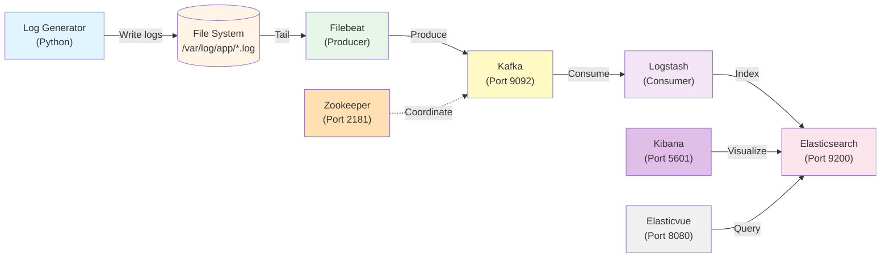

# ELK Demo with Kafka Integration

A production-ready, distributed logging pipeline using the complete ELK stack with Apache Kafka message queue for high-throughput, fault-tolerant log processing.

## Architecture



## Data Flow

**Complete Pipeline:**
```
Log Generator → Files → Filebeat → Kafka Topic → Logstash → Elasticsearch ← Kibana/Elasticvue
```

This setup demonstrates the industry-standard pattern for high-volume logging:
- **Applications** write logs to files (fast, non-blocking)
- **Filebeat** tails log files and produces to Kafka
- **Kafka** provides durable message buffering and decoupling
- **Logstash** consumes from Kafka, parses JSON, and enriches data
- **Elasticsearch** stores and indexes processed logs
- **Kibana** provides powerful visualization, dashboards, and analytics
- **Elasticvue** (optional) provides lightweight browser-based queries

## Components

1. **Elasticsearch** (v8.19.0): Search and analytics engine
2. **Log Generator**: Python app generating synthetic JSON logs
3. **Filebeat** (v8.19.0): Lightweight log shipper (Kafka producer)
4. **Zookeeper**: Cluster coordination for Kafka
5. **Kafka**: Distributed message queue and streaming platform
6. **Logstash** (v8.19.0): Data processing pipeline (Kafka consumer)
7. **Kibana** (v8.19.0): Analytics and visualization platform
8. **Elasticvue** (optional): Lightweight browser-based Elasticsearch UI

## Why Kafka?

### Benefits Over Direct Logstash

| Feature | Without Kafka | With Kafka |
|---------|---------------|------------|
| **Buffering** | Limited (in-memory) | Disk-based (durable) |
| **Durability** | Messages can be lost | Persisted to disk |
| **Backpressure** | Filebeat blocks if Logstash slow | Kafka absorbs spikes |
| **Replay** | ❌ Not possible | ✅ Reset offset to replay |
| **Scaling** | 1:1 coupling | N:M (many producers/consumers) |
| **Recovery** | 5-10 minutes | 1-5 minutes |
| **Throughput** | ~5,000 logs/sec | ~10,000+ logs/sec |

### Use Cases for Kafka Integration

- ✅ **High volume**: >10,000 logs per second
- ✅ **Multiple consumers**: Send same logs to different pipelines
- ✅ **Replay capability**: Reprocess historical logs
- ✅ **Durability**: Cannot afford to lose logs during outages
- ✅ **Decoupling**: Independent scaling of producers and consumers
- ✅ **Stream processing**: Future integration with Kafka Streams or Flink

## Quick Start

### Start the Stack

```bash
podman-compose up -d
```

This starts all 8 services:
- Elasticsearch (ports 9200, 9300)
- Zookeeper (port 2181)
- Kafka (port 9092)
- Log Generator (writes to /var/log/app/)
- Filebeat (produces to Kafka topic "filebeat-logs")
- Logstash (consumes from Kafka, processes, sends to ES)
- Kibana (port 5601)
- Elasticvue (port 8080, optional)

### Verify the Pipeline

```bash
# 1. Check all services are running
podman ps --format "table {{.Names}}\t{{.Status}}"

# 2. Verify Kafka topic exists
podman exec kafka kafka-topics.sh --list --bootstrap-server localhost:9092

# 3. Check consumer group lag (should be 0 or very low)
podman exec kafka kafka-consumer-groups.sh --describe \
  --group logstash-consumer-group \
  --bootstrap-server localhost:9092

# 4. Count indexed logs
curl -s 'http://localhost:9200/kafka-logstash-logs-*/_count' | jq '.'

# 5. View sample parsed log
curl -s 'http://localhost:9200/kafka-logstash-logs-*/_search?size=1&sort=@timestamp:desc' | \
  jq '.hits.hits[0]._source | {timestamp: ."@timestamp", level: .app.level, service: .app.service, message: .app.message}'
```

## Access Kibana

Kibana is the primary visualization and analytics interface for your logs.

### Open Kibana

Open browser: **http://localhost:5601**

Kibana will automatically connect to Elasticsearch. The first time you open Kibana, you'll see the welcome screen.

### Create Data View (Index Pattern)

Before you can visualize data, you need to create a Data View:

1. **Navigate to Management**:
   - Click the hamburger menu (☰) in the top left
   - Go to **Management** → **Stack Management**
   - Select **Kibana** → **Data Views**

2. **Create Data View**:
   - Click **"Create data view"** button
   - **Name**: `Kafka Logs`
   - **Index pattern**: `kafka-logstash-logs-*`
   - **Timestamp field**: `@timestamp`
   - Click **"Save data view to Kibana"**

Alternatively, create it via API:
```bash
curl -X POST "http://localhost:5601/api/data_views/data_view" \
  -H 'Content-Type: application/json' \
  -H 'kbn-xsrf: true' \
  -d '{
  "data_view": {
    "title": "kafka-logstash-logs-*",
    "name": "Kafka Logs",
    "timeFieldName": "@timestamp"
  }
}'
```

### Discover Logs

1. **Open Discover**:
   - Click the hamburger menu (☰)
   - Select **Analytics** → **Discover**

2. **Select Data View**:
   - In the top left dropdown, select **"Kafka Logs"**

3. **Explore Your Logs**:
   - You'll see all logs in a timeline view
   - Time range selector in top right (default: Last 15 minutes)
   - Click on any log to expand and see all fields
   - Use the search bar for KQL queries

### Example Kibana Queries (KQL)

**Filter by log level:**
```kql
app.level: "ERROR"
```

**Filter by service:**
```kql
app.service: "payment-service"
```

**Multiple conditions (AND):**
```kql
app.level: "ERROR" AND app.service: "payment-service"
```

**Multiple conditions (OR):**
```kql
app.level: ("ERROR" OR "WARNING")
```

**Find slow requests:**
```kql
app.duration_ms > 2000
```

**Wildcard search in message:**
```kql
app.message: *timeout*
```

**Combine filters:**
```kql
app.level: "ERROR" AND app.duration_ms > 1000
```

### Create Visualizations

1. **Navigate to Visualize**:
   - Hamburger menu (☰) → **Analytics** → **Visualize Library**
   - Click **"Create visualization"**

2. **Choose Visualization Type**:
   - **Bar chart**: Logs over time by level
   - **Pie chart**: Distribution by service
   - **Line chart**: Trends over time
   - **Data table**: Detailed breakdowns
   - **Metric**: Count of errors

3. **Example: Logs by Level (Pie Chart)**:
   - Select **Pie** chart
   - Choose data view: **Kafka Logs**
   - Click **"Add field"** for slice
   - Select **"app.level"**
   - Top values: 10
   - Click **"Save"** and name it "Logs by Level"

4. **Example: Logs Over Time (Bar Chart)**:
   - Select **Bar vertical** chart
   - Choose data view: **Kafka Logs**
   - X-axis: Timestamp (automatic)
   - Breakdown by: **app.level**
   - Save as "Logs Timeline"

5. **Example: Top Services (Data Table)**:
   - Select **Table**
   - Metrics: Count
   - Split rows: Terms → **app.service.keyword**
   - Order by: Metric descending
   - Save as "Top Services"

### Create Dashboard

1. **Create New Dashboard**:
   - Hamburger menu (☰) → **Analytics** → **Dashboard**
   - Click **"Create dashboard"**

2. **Add Visualizations**:
   - Click **"Add from library"**
   - Select the visualizations you created
   - Arrange and resize panels as needed

3. **Example Dashboard Layout**:
   ```
   ┌─────────────────────────────────────────┐
   │  Total Logs (Metric)   │  Error Rate   │
   ├─────────────────────────────────────────┤
   │  Logs Timeline (Bar Chart)              │
   ├─────────────────────────────────────────┤
   │  Logs by Level  │  Top Services         │
   │  (Pie Chart)    │  (Data Table)         │
   └─────────────────────────────────────────┘
   ```

4. **Save Dashboard**:
   - Click **"Save"** in top right
   - Name: "Kafka Logs Overview"
   - Add description (optional)
   - Click **"Save"**

### Elasticvue (Optional Lightweight Alternative)

Open browser: http://localhost:8080

**First-time setup:**
1. Click "Add elasticsearch cluster"
2. Uri: `http://localhost:9200`
3. Click "Test connection" then "Connect"

## Query Examples

### Basic Queries

```bash
# Count all logs
curl 'http://localhost:9200/kafka-logstash-logs-*/_count'

# Get recent logs
curl 'http://localhost:9200/kafka-logstash-logs-*/_search?size=5&sort=@timestamp:desc&pretty'

# Filter by log level
curl -X GET 'http://localhost:9200/kafka-logstash-logs-*/_search?pretty' -H 'Content-Type: application/json' -d'
{
  "query": {
    "term": {
      "app.level": "ERROR"
    }
  },
  "size": 10
}'

# Filter by service
curl -X GET 'http://localhost:9200/kafka-logstash-logs-*/_search?pretty' -H 'Content-Type: application/json' -d'
{
  "query": {
    "term": {
      "app.service.keyword": "payment-service"
    }
  }
}'

# Find slow requests (> 2 seconds)
curl -X GET 'http://localhost:9200/kafka-logstash-logs-*/_search?pretty' -H 'Content-Type: application/json' -d'
{
  "query": {
    "range": {
      "app.duration_ms": {
        "gte": 2000
      }
    }
  },
  "sort": [{"app.duration_ms": "desc"}]
}'
```

### Aggregations

```bash
# Count logs by level
curl -X GET 'http://localhost:9200/kafka-logstash-logs-*/_search?pretty' -H 'Content-Type: application/json' -d'
{
  "size": 0,
  "aggs": {
    "by_level": {
      "terms": {
        "field": "app.level"
      }
    }
  }
}'

# Average response time by service
curl -X GET 'http://localhost:9200/kafka-logstash-logs-*/_search?pretty' -H 'Content-Type: application/json' -d'
{
  "size": 0,
  "aggs": {
    "by_service": {
      "terms": {
        "field": "app.service.keyword"
      },
      "aggs": {
        "avg_duration": {
          "avg": {
            "field": "app.duration_ms"
          }
        }
      }
    }
  }
}'
```

## Monitoring

### View Logs

```bash
# Log generator (see logs being written)
podman logs -f log-generator

# Filebeat (see events being sent to Kafka)
podman logs -f filebeat

# Kafka (broker logs)
podman logs -f kafka

# Logstash (see JSON parsing and processing)
podman logs -f logstash
```

### Kafka Monitoring

```bash
# List topics
podman exec kafka kafka-topics.sh --list --bootstrap-server localhost:9092

# Describe topic (partitions, replicas)
podman exec kafka kafka-topics.sh --describe --topic filebeat-logs --bootstrap-server localhost:9092

# Consumer group lag (IMPORTANT: should be 0 or very low)
podman exec kafka kafka-consumer-groups.sh --describe \
  --group logstash-consumer-group \
  --bootstrap-server localhost:9092

# Peek at messages in topic
podman exec kafka kafka-console-consumer.sh \
  --bootstrap-server localhost:9092 \
  --topic filebeat-logs \
  --from-beginning \
  --max-messages 5
```

**Key Metric: Consumer Lag**
```
GROUP                    TOPIC           PARTITION  CURRENT-OFFSET  LOG-END-OFFSET  LAG
logstash-consumer-group  filebeat-logs   0          1234            1234            0
```
- **LAG = 0**: Logstash is keeping up perfectly ✅
- **LAG > 100**: Logstash falling behind ⚠️
- **LAG growing**: Need to scale (add partitions + consumers) 🔴

### Elasticsearch Health

```bash
# Cluster health (should be "yellow" for single-node)
curl 'http://localhost:9200/_cluster/health?pretty'

# List indices
curl 'http://localhost:9200/_cat/indices?v'

# Index stats
curl 'http://localhost:9200/_cat/indices/kafka-logstash-logs-*?v&h=index,docs.count,store.size'
```

## Configuration Files

### Filebeat (`filebeat/filebeat.yml`)

```yaml
output.kafka:
  hosts: ["kafka:9092"]
  topic: "filebeat-logs"
  partition.round_robin:
    reachable_only: false
  required_acks: 1          # Wait for leader ack (balance speed/durability)
  compression: gzip         # Compress messages
  max_message_bytes: 1000000
```

### Logstash (`logstash/pipeline/logstash.conf`)

```ruby
input {
  kafka {
    bootstrap_servers => "kafka:9092"
    topics => ["filebeat-logs"]
    codec => "json"
    consumer_threads => 1
    decorate_events => true
    group_id => "logstash-consumer-group"
  }
}

filter {
  # Parse JSON from message field
  json {
    source => "message"
    target => "app"
  }
  
  # Add tracking metadata
  mutate {
    add_field => { 
      "pipeline_stage" => "logstash"
      "processed_at" => "%{@timestamp}"
    }
  }
  
  # Use log's timestamp
  if [app][timestamp] {
    date {
      match => [ "[app][timestamp]", "ISO8601" ]
      target => "@timestamp"
    }
  }
}

output {
  elasticsearch {
    hosts => ["elasticsearch:9200"]
    index => "kafka-logstash-logs-%{+YYYY.MM.dd}"
  }
  stdout { codec => rubydebug }
}
```

## Troubleshooting

### Kafka Not Reachable

```bash
# Check Kafka is running
podman ps | grep kafka

# Check Kafka health
podman exec kafka kafka-broker-api-versions.sh --bootstrap-server localhost:9092

# View Kafka logs
podman logs kafka | tail -50
```

### Consumer Lag Growing

**Problem:** LAG keeps increasing
**Cause:** Logstash consuming slower than Filebeat producing

**Solutions:**

1. **Scale horizontally** (add partitions + consumers):
```bash
# Create topic with 3 partitions
podman exec kafka kafka-topics.sh --create \
  --topic filebeat-logs-scaled \
  --partitions 3 \
  --replication-factor 1 \
  --bootstrap-server localhost:9092

# Run 3 Logstash instances (update docker-compose)
```

2. **Optimize Logstash**:
```ruby
# Increase batch size
pipeline.batch.size: 250
pipeline.batch.delay: 50

# More worker threads
pipeline.workers: 4
```

### Messages Not Reaching Elasticsearch

```bash
# 1. Check Filebeat is sending to Kafka
podman logs filebeat | grep -i kafka

# 2. Check messages in Kafka topic
podman exec kafka kafka-console-consumer.sh \
  --bootstrap-server localhost:9092 \
  --topic filebeat-logs \
  --max-messages 1

# 3. Check Logstash is consuming
podman logs logstash | grep -i kafka

# 4. Verify Elasticsearch indexing
curl 'http://localhost:9200/_cat/indices/kafka-*?v'
```

### Replay Old Logs

Reset consumer offset to reprocess logs:

```bash
# Stop Logstash
podman stop logstash

# Reset offset to beginning
podman exec kafka kafka-consumer-groups.sh \
  --bootstrap-server localhost:9092 \
  --group logstash-consumer-group \
  --topic filebeat-logs \
  --reset-offsets \
  --to-earliest \
  --execute

# Start Logstash (will reprocess all messages)
podman start logstash
```

**Other offset options:**
- `--to-earliest`: From beginning
- `--to-latest`: Skip to newest
- `--to-datetime 2026-01-15T10:00:00.000`: From specific time
- `--to-offset 1000`: From specific offset

## Performance Tuning

### Kafka Configuration

Edit `podman-compose.yml`:

```yaml
kafka:
  environment:
    # Increase partition count for better parallelism
    KAFKA_CREATE_TOPICS: "filebeat-logs:3:1"  # 3 partitions
    
    # Increase message size limit
    KAFKA_MESSAGE_MAX_BYTES: 10485760  # 10MB
    
    # Adjust retention (default 7 days)
    KAFKA_LOG_RETENTION_HOURS: 168
```

### Filebeat Tuning

```yaml
# Increase batch size
output.kafka:
  bulk_max_size: 2048
  
# Increase workers
queue.mem:
  events: 4096
  flush.min_events: 512
```

### Logstash Tuning

```ruby
# In logstash.yml
pipeline.workers: 4            # Match CPU cores
pipeline.batch.size: 250       # Larger batches
pipeline.batch.delay: 50       # ms to wait before batch

# In input
kafka {
  consumer_threads => 3        # Match partition count
}
```

## Clean Up

```bash
# Stop all services
podman-compose down

# Remove all data (including Kafka messages)
podman-compose down -v
```

## Documentation

- **[ARCHITECTURE.md](./ARCHITECTURE.md)**: Detailed evolution through all 4 phases
- **[README.md](./README.md)**: Original ELK stack without Kafka

## Next Steps

To extend this setup:

- **Add Kibana**: Replace Elasticvue with full Kibana dashboards
- **Multiple Kafka Consumers**: Send logs to S3, monitoring systems
- **Stream Processing**: Add Kafka Streams or Apache Flink
- **Security**: Enable Kafka SSL/SASL, Elasticsearch security
- **Monitoring**: Add Prometheus + Grafana for metrics
- **Index Lifecycle Management**: Automate index rotation and deletion

## Resources

- [Apache Kafka Documentation](https://kafka.apache.org/documentation/)
- [Filebeat Kafka Output](https://www.elastic.co/guide/en/beats/filebeat/current/kafka-output.html)
- [Logstash Kafka Input](https://www.elastic.co/guide/en/logstash/current/plugins-inputs-kafka.html)
- [Elastic Stack Documentation](https://www.elastic.co/guide/index.html)
- **[KIBANA-GUIDE.md](./KIBANA-GUIDE.md)**: Complete Kibana visualization tutorial
