# ELK Demo - Complete ELK Stack with Logstash

A production-ready logging pipeline using the complete ELK stack (Elasticsearch, Logstash, Kibana/Elasticvue) with Filebeat for log shipping and synthetic log generation using Podman.

> **🚀 NEW: Kafka Integration Available!**  
> This branch demonstrates the basic ELK stack. For a production-grade setup with Apache Kafka message queue (high-throughput, fault-tolerant, replay capability), see **[README-KAFKA.md](./README-KAFKA.md)** or switch to the `kafka` branch.

## Architecture Versions

### Current: Phase 3 - Direct Filebeat to Logstash
```
Log Generator (Python) → File System (/var/log/app/*.log) → Filebeat → Logstash → Elasticsearch ← Elasticvue (Web UI)
```

### Available: Phase 4 - Kafka Message Queue ([README-KAFKA.md](./README-KAFKA.md))
```
Log Generator → Files → Filebeat → Kafka Topic → Logstash → Elasticsearch ← Elasticvue
                                    ↑
                                Zookeeper
```

**Why Kafka?** Adds durable buffering, replay capability, horizontal scaling, and handles 10,000+ logs/sec. See [README-KAFKA.md](./README-KAFKA.md) for details.

---

This setup demonstrates the industry-standard ELK (Elasticsearch, Logstash, Kibana) stack pattern where:
- **Applications** write logs to files (log-generator writes JSON logs)
- **Filebeat** (lightweight shipper) tails log files and forwards to Logstash
- **Logstash** (data processing pipeline) parses, transforms, and enriches log data
- **Elasticsearch** (search & analytics engine) stores and indexes processed logs
- **Elasticvue** (web UI) provides visualization and search capabilities

## Components

1. **Elasticsearch**: Stores and indexes logs (v8.19.0)
2. **Log Generator**: Python app that generates random synthetic JSON logs and writes them to files
3. **Filebeat**: Lightweight log shipper that tails log files and sends to Logstash (v8.19.0)
4. **Logstash**: Data processing pipeline that parses JSON, enriches data, and sends to Elasticsearch (v8.19.0)
5. **Elasticvue**: Browser-based UI for querying and viewing Elasticsearch data

## Features

- 🚀 Complete ELK Stack with proper data flow
- 📊 Synthetic JSON log generation with realistic data patterns
- 🔄 Continuous log streaming (1-5 second intervals)
- 📁 File-based log shipping via Filebeat (production pattern)
- 🔧 Logstash JSON parsing and data transformation
- 💾 Persistent volume storage for Elasticsearch data and Filebeat registry
- 🌐 Network isolation with dedicated bridge network
- 🖥️ Web UI (Elasticvue) for easy data exploration

## Logstash Pipeline

The Logstash configuration (`logstash/pipeline/logstash.conf`) includes:
- **Input**: Beats input on port 5044
- **Filter**: 
  - JSON parser to extract log fields from message
  - Mutate filter to add pipeline tracking fields
  - Date filter to use log timestamp as event timestamp
- **Output**: 
  - Elasticsearch (index: `logstash-app-logs-*`)
  - Stdout with rubydebug for debugging

## Setup

### Prerequisites
- Podman (or Docker)
- Podman Compose (or Docker Compose)
- curl and jq (for testing)

### Start the Services

```bash
podman-compose up -d
```

This will start:
- Elasticsearch on ports 9200 (HTTP) and 9300 (Transport)
- Log Generator (writes JSON logs to /var/log/app/application.log)
- Filebeat (tails log files and ships to Logstash on port 5044)
- Logstash (processes logs and sends to Elasticsearch on ports 5044 and 9600)
- Elasticvue on port 8080 (Web UI)

### Access Elasticvue Web UI

Open your browser and go to:
```
http://localhost:8080
```

**First-time Setup:**
1. Click "Add elasticsearch cluster"
2. Enter cluster details:
   - **Name**: Local Elasticsearch (or any name you prefer)
   - **Uri**: `http://localhost:9200` (use localhost, not elasticsearch)
3. Click "Test connection" then "Connect"

**Note**: Use `http://localhost:9200` because you're connecting from your browser (host machine), not from inside the container network.

**Features Available:**
- 📊 Browse indices and documents
- 🔍 Search with visual query builder
- 📝 View and edit documents
- 📈 Cluster health monitoring
- 🎯 Index management

### View Real-Time Logs

```bash
# View log generator output (see logs being written)
podman logs -f log-generator

# View Filebeat logs (see log shipping to Logstash)
podman logs -f filebeat

# View Logstash logs (see data processing and parsed JSON)
podman logs -f logstash

# View Elasticsearch logs
podman logs -f elasticsearch

# View actual log file being tailed by Filebeat
podman exec log-generator tail -f /var/log/app/application.log
```

### Check Elasticsearch Status

```bash
# Basic status
curl http://localhost:9200

# Cluster health (should be "yellow" for single-node)
curl 'http://localhost:9200/_cluster/health?pretty'

# List all indices
### Query Stored Logs

**Note**: Logs are indexed in `logstash-app-logs-*` indices with parsed JSON fields in the `app` object.

#### Basic Queries

```bash
# Get count of stored logs from Logstash index
curl 'http://localhost:9200/logstash-app-logs-*/_count'

# View sample logs (last 5)
curl 'http://localhost:9200/logstash-app-logs-*/_search?pretty&size=5&sort=@timestamp:desc'

# View specific fields only (parsed JSON)
curl 'http://localhost:9200/logstash-app-logs-*/_search?pretty&size=5&sort=@timestamp:desc' | jq '.hits.hits[]._source | {timestamp: ."@timestamp", level: .app.level, service: .app.service, message: .app.message, user: .app.user_id}'

# Get all logs (match_all)
curl -X GET 'http://localhost:9200/logstash-app-logs-*/_search?pretty' -H 'Content-Type: application/json' -d'
{
  "query": {
    "match_all": {}
  },
  "size": 10,
  "sort": [{"@timestamp": "desc"}]
}
'
```

#### Search by Parsed Fields

```bash
# Search logs by level (ERROR only)
curl -X GET 'http://localhost:9200/logstash-app-logs-*/_search?pretty' -H 'Content-Type: application/json' -d'
{
  "query": {
    "term": {
      "app.level": "ERROR"
    }
  },
  "size": 10,
  "sort": [{"@timestamp": "desc"}]
}
'

# Search by service
curl -X GET 'http://localhost:9200/logstash-app-logs-*/_search?pretty' -H 'Content-Type: application/json' -d'
{
  "query": {
    "term": {
      "app.service.keyword": "payment-service"
    }
  },
  "size": 10
}
'

# Search by status code
curl -X GET 'http://localhost:9200/logstash-app-logs-*/_search?pretty' -H 'Content-Type: application/json' -d'
{
  "query": {
    "term": {
      "app.status_code": 500
    }
  },
  "size": 10
}
'
```

#### Range Queries

```bash
# Get logs from last 5 minutes
curl -X GET 'http://localhost:9200/logstash-app-logs-*/_search?pretty' -H 'Content-Type: application/json' -d'
{
  "query": {
    "range": {
      "@timestamp": {
        "gte": "now-5m",
        "lte": "now"
      }
    }
  },
  "sort": [{"@timestamp": "desc"}]
}
'

# Find slow requests (duration > 2000ms)
curl -X GET 'http://localhost:9200/logstash-app-logs-*/_search?pretty' -H 'Content-Type: application/json' -d'
{
  "query": {
    "range": {
      "app.duration_ms": {
        "gte": 2000
      }
    }
  },
  "sort": [{"app.duration_ms": "desc"}]
}
'

# Find server errors (status code 500-599)
curl -X GET 'http://localhost:9200/app-logs/_search?pretty' -H 'Content-Type: application/json' -d'
{
  "query": {
    "range": {
      "status_code": {
        "gte": 500,
        "lt": 600
      }
    }
  }
}
'
```

#### Complex Queries (Bool Query)

```bash
# Combine multiple conditions (must = AND)
curl -X GET 'http://localhost:9200/app-logs/_search?pretty' -H 'Content-Type: application/json' -d'
{
  "query": {
    "bool": {
      "must": [
        { "match": { "level": "ERROR" } },
        { "match": { "service": "payment-service" } }
      ],
      "filter": [
        { "range": { "timestamp": { "gte": "now-1h" } } }
      ]
    }
  }
}
'

# Exclude certain conditions (must_not = NOT)
curl -X GET 'http://localhost:9200/app-logs/_search?pretty' -H 'Content-Type: application/json' -d'
{
  "query": {
    "bool": {
      "must": [
        { "match": { "level": "ERROR" } }
      ],
      "must_not": [
        { "term": { "status_code": 404 } }
      ]
    }
  }
}
'

# Any of conditions (should = OR)
curl -X GET 'http://localhost:9200/app-logs/_search?pretty' -H 'Content-Type: application/json' -d'
{
  "query": {
    "bool": {
      "should": [
        { "match": { "level": "ERROR" } },
        { "match": { "level": "WARNING" } }
      ],
      "minimum_should_match": 1
    }
  }
}
'
```

#### Sorting and Pagination

```bash
# Sort by timestamp (newest first)
curl -X GET 'http://localhost:9200/app-logs/_search?pretty' -H 'Content-Type: application/json' -d'
{
  "query": { "match_all": {} },
  "sort": [
    { "timestamp": { "order": "desc" } }
  ],
  "size": 10,
  "from": 0
}
'

# Top 5 slowest requests
curl -X GET 'http://localhost:9200/app-logs/_search?pretty' -H 'Content-Type: application/json' -d'
{
  "query": { "match_all": {} },
  "sort": [
    { "duration_ms": { "order": "desc" } }
  ],
  "size": 5
}
'

# Pagination (page 2, 10 results per page)
curl -X GET 'http://localhost:9200/app-logs/_search?pretty' -H 'Content-Type: application/json' -d'
{
  "query": { "match_all": {} },
  "size": 10,
  "from": 10
}
'
```

#### Aggregations (Analytics)

```bash
# Count logs by level
curl -X GET 'http://localhost:9200/app-logs/_search?pretty' -H 'Content-Type: application/json' -d'
{
  "size": 0,
  "aggs": {
    "logs_by_level": {
      "terms": {
        "field": "level.keyword",
        "size": 10
      }
    }
  }
}
'

# Count logs by service
curl -X GET 'http://localhost:9200/app-logs/_search?pretty' -H 'Content-Type: application/json' -d'
{
  "size": 0,
  "aggs": {
    "logs_by_service": {
      "terms": {
        "field": "service.keyword"
      }
    }
  }
}
'

# Average response time
curl -X GET 'http://localhost:9200/logstash-app-logs-*/_search?pretty' -H 'Content-Type: application/json' -d'
{
  "size": 0,
  "aggs": {
    "avg_duration": {
      "avg": {
        "field": "app.duration_ms"
      }
    }
  }
}
'

# Statistics on duration
curl -X GET 'http://localhost:9200/logstash-app-logs-*/_search?pretty' -H 'Content-Type: application/json' -d'
{
  "size": 0,
  "aggs": {
    "duration_stats": {
      "stats": {
        "field": "app.duration_ms"
      }
    }
  }
}
'

# Count unique users
curl -X GET 'http://localhost:9200/logstash-app-logs-*/_search?pretty' -H 'Content-Type: application/json' -d'
{
  "size": 0,
  "aggs": {
    "unique_users": {
      "cardinality": {
        "field": "app.user_id.keyword"
      }
    }
  }
}
'

# Logs over time (histogram)
curl -X GET 'http://localhost:9200/logstash-app-logs-*/_search?pretty' -H 'Content-Type: application/json' -d'
{
  "size": 0,
  "aggs": {
    "logs_over_time": {
      "date_histogram": {
        "field": "@timestamp",
        "calendar_interval": "minute"
      }
    }
  }
}
'
```

#### Select Specific Fields

```bash
# Return only specific fields from parsed JSON
curl -X GET 'http://localhost:9200/logstash-app-logs-*/_search?pretty' -H 'Content-Type: application/json' -d'
{
  "_source": ["@timestamp", "app.level", "app.service", "app.message", "app.user_id"],
  "query": {
    "term": {
      "app.level": "ERROR"
    }
  },
  "sort": [{"@timestamp": "desc"}]
}
'
```

### Stop the Services

```bash
podman-compose down
```

### Clean Up (Remove Volumes and Data)

```bash
podman-compose down -v
```

## Troubleshooting

### Elasticsearch shows "yellow" cluster status
This is **normal and expected** for a single-node cluster!

**Why Yellow?**
- 🟡 Yellow means all primary shards are active, but replica shards cannot be assigned
- Single-node clusters can't place replicas (they must be on different nodes)
- Your data is safe and accessible - this is the correct state for development

**Cluster Status Colors:**
- 🟢 **Green**: All primary and replica shards allocated (requires multiple nodes)
- 🟡 **Yellow**: All primaries allocated, some replicas unassigned (normal for single-node)
- 🔴 **Red**: Some primary shards missing (data loss risk)

```bash
# Check cluster health
curl 'http://localhost:9200/_cluster/health?pretty'
```

### Elasticsearch shows "red" cluster status
This indicates missing primary shards. Usually due to disk space issues:
```bash
# Check cluster health
curl 'http://localhost:9200/_cluster/health?pretty'

# Check disk space
df -h
```

### Log generator not sending logs
```bash
# Check if containers are running
podman ps

# Restart log generator
podman-compose restart log-generator

# Check logs for errors
podman logs log-generator
```

### Filebeat not shipping logs
```bash
# Check Filebeat status
podman logs filebeat

# Verify Logstash is reachable
podman exec filebeat curl -v logstash:5044

# Restart Filebeat
podman-compose restart filebeat
```

### Logstash not processing logs
```bash
# Check Logstash logs
podman logs logstash

# Verify Logstash is receiving data from Filebeat
podman logs logstash | grep "Beats inputs"

# Check Logstash health endpoint
curl http://localhost:9600

# Restart Logstash
podman-compose restart logstash
```

### No data in Elasticsearch
```bash
# Check if indices exist
curl 'http://localhost:9200/_cat/indices?v'

# Verify data flow
podman logs log-generator | tail -5  # Should show logs being written
podman logs filebeat | tail -20       # Should show events being sent
podman logs logstash | tail -20       # Should show JSON parsed logs
curl 'http://localhost:9200/logstash-app-logs-*/_count'  # Should return count > 0
```

## Data Flow Diagram

```mermaid
flowchart LR
    A["Log Generator<br/>(Python 3.11)<br/>• Generates synthetic logs<br/>• Random intervals (1-5s)<br/>• Multiple log levels & services"]
    B[("File System<br/>/var/log/app/*.log")]
    C["Filebeat<br/>(v8.19.0)<br/>• Lightweight shipper<br/>• Tails log files<br/>• Volume: filebeat-data"]
    D["Logstash<br/>(v8.19.0)<br/>• Port: 5044 (Beats input)<br/>• Port: 9600 (Health)<br/>• JSON parsing & enrichment"]
    E["Elasticsearch<br/>(v8.19.0)<br/>• Port: 9200 (HTTP API)<br/>• Port: 9300 (Transport)<br/>• Single-node cluster<br/>• Volume: elasticsearch-data"]
    F["Elasticvue<br/>(Web UI)<br/>• Port: 8080<br/>• Browse & query data<br/>• Visual interface"]
    
    A -->|"Writes JSON logs"| B
    B -->|"Filestream input"| C
    C -->|"Ships logs<br/>(port 5044)"| D
    D -->|"Indexed data<br/>(logstash-app-logs-*)"| E
    F -->|"Query & visualize<br/>(port 9200)"| E
    
    style A fill:#e1f5ff
    style B fill:#fff4e6
    style C fill:#e8f5e9
    style D fill:#f3e5f5
    style E fill:#fce4ec
    style F fill:#fff9c4
```



## Upgrade to Kafka Integration

**Ready for production-grade logging?**

The current setup works well for development and small-scale deployments. For high-volume production environments, consider upgrading to the **Kafka-integrated architecture**:

### When to Add Kafka

| Scenario | Without Kafka | With Kafka |
|----------|---------------|------------|
| **Volume** | < 5,000 logs/sec | > 10,000 logs/sec |
| **Durability** | In-memory buffering | Disk-persisted messages |
| **Replay** | ❌ Not possible | ✅ Reset offset to replay |
| **Scaling** | Vertical only | Horizontal (partitions) |
| **Recovery Time** | 5-10 minutes | 1-5 minutes |
| **Multiple Consumers** | ❌ No | ✅ Yes (same logs → multiple pipelines) |

### Quick Switch to Kafka

```bash
# Switch to kafka branch
git checkout kafka

# Start the enhanced stack (7 services)
podman-compose up -d

# Verify Kafka is working
podman exec kafka kafka-topics.sh --list --bootstrap-server localhost:9092
```

**📘 Full Documentation:** See **[README-KAFKA.md](./README-KAFKA.md)** for:
- Complete architecture diagrams with Kafka
- Kafka monitoring and consumer lag management
- Performance tuning for high-throughput
- How to replay historical logs
- Troubleshooting Kafka-specific issues

### Architecture Evolution

This project demonstrates the complete evolution of logging architectures:

1. **Phase 1**: Direct Elasticsearch integration (simple, limited)
2. **Phase 2**: Filebeat added (file-based shipping)
3. **Phase 3**: Logstash added (data processing) ← **You are here**
4. **Phase 4**: Kafka added (enterprise-grade) ← **[README-KAFKA.md](./README-KAFKA.md)**

**📖 Detailed Evolution:** See **[ARCHITECTURE.md](./ARCHITECTURE.md)** for comprehensive documentation of all 4 phases with diagrams, comparisons, and use cases.

## Next Steps

This is a basic setup. To expand further, consider:
- **Add Kafka**: See [README-KAFKA.md](./README-KAFKA.md) for enterprise features
- Adding Kibana for advanced visualization and dashboards
- Implementing index lifecycle management (ILM)
- Setting up security (authentication & encryption)
- Creating custom dashboards and visualizations
- Adding alerting with ElastAlert or Watcher
