# ELK Demo Architecture Evolution

This document explains the evolution of our logging architecture through four phases, detailing how each component works, why changes were made, and the benefits of each approach.

---

## Table of Contents

1. [Phase 1: Direct Elasticsearch Integration](#phase-1-direct-elasticsearch-integration)
2. [Phase 2: Filebeat Integration](#phase-2-filebeat-integration)
3. [Phase 3: Complete ELK Stack with Logstash](#phase-3-complete-elk-stack-with-logstash)
4. [Phase 4: Kafka Message Queue Integration](#phase-4-kafka-message-queue-integration)
5. [Comparison Matrix](#comparison-matrix)
6. [Best Practices & Lessons Learned](#best-practices--lessons-learned)

---

## Phase 1: Direct Elasticsearch Integration

### Overview
The simplest approach where the application sends logs directly to Elasticsearch via HTTP API.

### Architecture Diagram


### Sequence Diagram

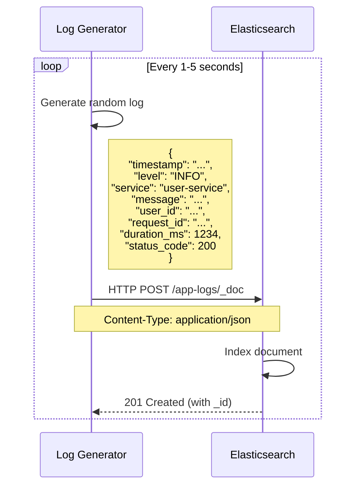

### Implementation Details

#### Log Generator (`log-generator/app.py`)
```python
def send_log_to_elasticsearch(log_entry):
    """Send log directly to Elasticsearch HTTP API"""
    try:
        response = requests.post(
            f"{ELASTICSEARCH_URL}/app-logs/_doc",
            json=log_entry,
            headers={"Content-Type": "application/json"}
        )
        response.raise_for_status()
        print(f"✓ Log sent: {log_entry['level']} - {log_entry['service']}")
    except requests.exceptions.RequestException as e:
        print(f"✗ Failed to send log: {e}")
```

#### Docker Compose Configuration
```yaml
services:
  elasticsearch:
    image: docker.elastic.co/elasticsearch/elasticsearch:8.19.0
    ports:
      - "9200:9200"
    environment:
      - discovery.type=single-node
      - xpack.security.enabled=false
  
  log-generator:
    build: ./log-generator
    depends_on:
      - elasticsearch
    environment:
      - ELASTICSEARCH_URL=http://elasticsearch:9200
```

### Data Storage

| Field | Type | Description |
|-------|------|-------------|
| `timestamp` | date | ISO8601 timestamp |
| `level` | keyword | Log level (INFO, WARNING, ERROR, DEBUG) |
| `service` | keyword | Service name (user-service, payment-service, etc.) |
| `message` | text | Log message |
| `user_id` | keyword | User identifier |
| `request_id` | keyword | Request trace ID |
| `duration_ms` | long | Request duration in milliseconds |
| `status_code` | integer | HTTP status code |

### Advantages ✅

1. **Simplicity**: Direct HTTP API calls, no middleware
2. **Low Latency**: Immediate indexing
3. **Easy Setup**: Only 2 containers needed
4. **Simple Debugging**: Direct connection makes troubleshooting straightforward

### Disadvantages ❌

1. **Tight Coupling**: Application directly depends on Elasticsearch availability
2. **No Buffering**: If Elasticsearch is down, logs are lost
3. **Network Overhead**: Each log = one HTTP request
4. **No Transformation**: Can't enrich or parse logs before indexing
5. **Scalability Issues**: Application performance affected by Elasticsearch speed
6. **Security Risk**: Direct exposure of Elasticsearch to applications

### When to Use

- **Development/Testing**: Quick prototypes and local testing
- **Small Applications**: Low-volume logging (<1000 logs/day)
- **Simple Requirements**: No need for log processing or buffering

---

## Phase 2: Filebeat Integration

### Overview
Introducing Filebeat as a lightweight log shipper to decouple the application from Elasticsearch. The application writes logs to files, and Filebeat tails these files and ships them to Elasticsearch.

### Architecture Diagram

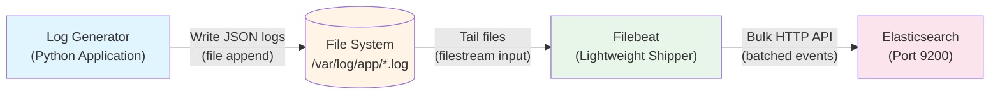

### Sequence Diagram

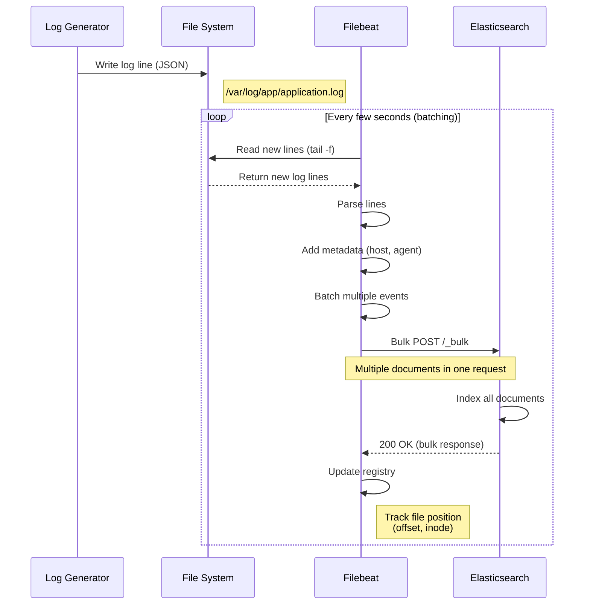

### Why This Change?

#### Problems Solved

1. **Decoupling**: Application no longer depends on Elasticsearch availability
2. **Resilience**: Logs persist in files even if Elasticsearch is down
3. **Performance**: Application writes to local disk (fast) instead of network calls
4. **Buffering**: Filebeat handles retries and backpressure
5. **Production Pattern**: Industry-standard approach for log collection

### Implementation Changes

#### 1. Log Generator Changes

**Before (Phase 1):**
```python
def send_log_to_elasticsearch(log_entry):
    response = requests.post(
        f"{ELASTICSEARCH_URL}/app-logs/_doc",
        json=log_entry
    )
```

**After (Phase 2):**
```python
def write_log_to_file(log_entry):
    """Write log to file in JSON format (one line per log)"""
    log_file = "/var/log/app/application.log"
    with open(log_file, "a") as f:
        f.write(json.dumps(log_entry) + "\n")
    print(f"✓ Log written: {log_entry['level']} - {log_entry['service']}")
```

**Key Differences:**
- Network call → File I/O (much faster)
- No error handling for Elasticsearch needed
- Logs persisted immediately
- No dependency on Elasticsearch uptime

#### 2. Filebeat Configuration (`filebeat/filebeat.yml`)

```yaml
filebeat.inputs:
  - type: filestream
    id: app-logs
    enabled: true
    paths:
      - /var/log/app/*.log
    fields:
      log_source: filebeat
    fields_under_root: true

output.elasticsearch:
  hosts: ["elasticsearch:9200"]
  index: "filebeat-app-logs-%{+yyyy.MM.dd}"
  
setup.ilm.enabled: false
setup.template.name: "filebeat-app-logs"
setup.template.pattern: "filebeat-app-logs-*"
```

**Configuration Breakdown:**

| Setting | Purpose |
|---------|---------|
| `type: filestream` | Modern file input (replaces deprecated `log` type) |
| `paths` | Glob pattern for log files to monitor |
| `fields` | Add custom metadata to each event |
| `output.elasticsearch` | Where to send logs |
| `index` | Custom index pattern with date |
| `setup.ilm.enabled: false` | Disable Index Lifecycle Management for simplicity |

#### 3. Docker Compose Changes

```yaml
services:
  log-generator:
    volumes:
      - app-logs:/var/log/app  # Shared volume for log files
    # Removed: ELASTICSEARCH_URL environment variable
  
  filebeat:
    image: docker.elastic.co/beats/filebeat:8.19.0
    volumes:
      - ./filebeat/filebeat.yml:/usr/share/filebeat/filebeat.yml:ro
      - app-logs:/var/log/app:ro  # Read-only access to log files
      - filebeat-data:/usr/share/filebeat/data  # Registry persistence
    depends_on:
      - elasticsearch

volumes:
  app-logs:  # Shared between log-generator and filebeat
  filebeat-data:  # Persists file positions
```

### How Filebeat Works

#### 1. File Tailing Mechanism

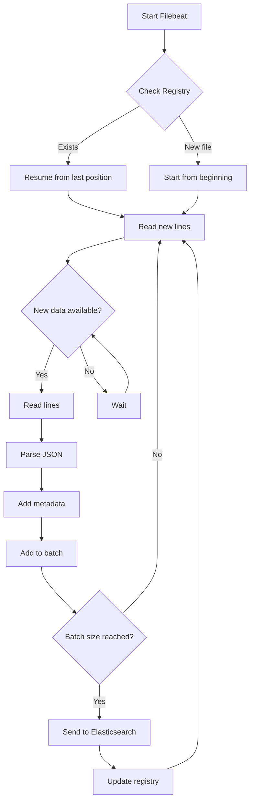

#### 2. Registry File

Filebeat maintains a registry to track:
- **File paths**: Which files are being monitored
- **Inodes**: File system identifiers (handles file rotation)
- **Offsets**: Current read position in each file
- **Timestamps**: Last modification times

**Registry Location:** `/usr/share/filebeat/data/registry/filebeat/`

**Example Registry Entry:**
```json
{
  "source": "/var/log/app/application.log",
  "offset": 123456,
  "timestamp": "2026-01-15T10:30:00Z",
  "ttl": -1,
  "type": "filestream",
  "id": "native::12345678-inode",
  "prev_id": ""
}
```

#### 3. Batching and Performance

| Metric | Value | Description |
|--------|-------|-------------|
| **Default Batch Size** | 50 events | Events collected before sending |
| **Batch Timeout** | 1 second | Max wait time before sending partial batch |
| **Max Batch Size** | 2048 events | Upper limit for single bulk request |
| **Worker Threads** | 1 | Concurrent workers sending to Elasticsearch |

**Batching Example:**
```
Time 0ms:  Event 1 arrives → Add to batch [1]
Time 50ms: Event 2 arrives → Add to batch [1, 2]
...
Time 500ms: Event 50 arrives → Batch full [1..50]
Time 501ms: Send bulk request with 50 events
Time 550ms: Elasticsearch responds 200 OK
Time 551ms: Update registry with new offsets
```

### Data Flow Comparison

| Aspect | Phase 1 (Direct) | Phase 2 (Filebeat) |
|--------|------------------|---------------------|
| **Write Operation** | HTTP POST (slow) | File append (fast) |
| **Network Calls** | One per log | Batched (50+ logs/request) |
| **Failure Impact** | Log lost | Log persists in file |
| **Retry Logic** | Application handles | Filebeat handles |
| **Metadata** | None | Host, agent, timestamp added |
| **Performance** | Blocking I/O | Async, buffered |

### Elasticsearch Index Structure

**Index Pattern:** `filebeat-app-logs-2026.01.15`

**Document Structure:**
```json
{
  "@timestamp": "2026-01-15T10:30:00.123Z",
  "message": "{\"timestamp\": \"...\", \"level\": \"INFO\", ...}",
  "log_source": "filebeat",
  "host": {
    "name": "filebeat-container",
    "architecture": "aarch64",
    "os": {
      "platform": "ubuntu",
      "version": "24.04.2 LTS"
    }
  },
  "agent": {
    "type": "filebeat",
    "version": "8.19.0"
  },
  "log": {
    "file": {
      "path": "/var/log/app/application.log",
      "offset": 123456,
      "inode": "58727076"
    }
  }
}
```

**Problem:** Logs are stored as raw strings in `message` field (not parsed).

### Advantages ✅

1. **Decoupled Architecture**: App independent of Elasticsearch
2. **Resilience**: Logs survive Elasticsearch downtime
3. **Better Performance**: Fast file I/O instead of network calls
4. **Automatic Retries**: Filebeat handles failures
5. **Metadata Enrichment**: Host, agent info added automatically
6. **Batching**: Reduced network overhead
7. **Production Ready**: Industry-standard pattern

### Disadvantages ❌

1. **Logs Not Parsed**: JSON stored as string in `message` field
2. **Harder to Query**: Can't filter by `level`, `service`, etc. directly
3. **Extra Component**: One more service to manage
4. **Disk Space**: Need to manage log file rotation
5. **Slight Delay**: Small latency between write and indexing

### When to Use

- **Production Applications**: Any real-world application
- **Microservices**: Multiple services writing to files
- **High Volume**: 1000+ logs per second
- **Reliability Critical**: Can't afford to lose logs

---

## Phase 3: Complete ELK Stack with Logstash

### Overview
Adding Logstash as a data processing pipeline between Filebeat and Elasticsearch. This allows us to parse JSON logs, enrich data, transform fields, and apply business logic before indexing.

### Architecture Diagram

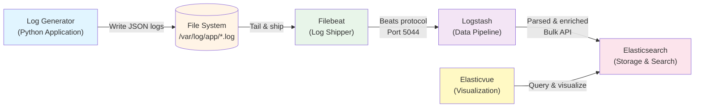

### Detailed Sequence Diagram

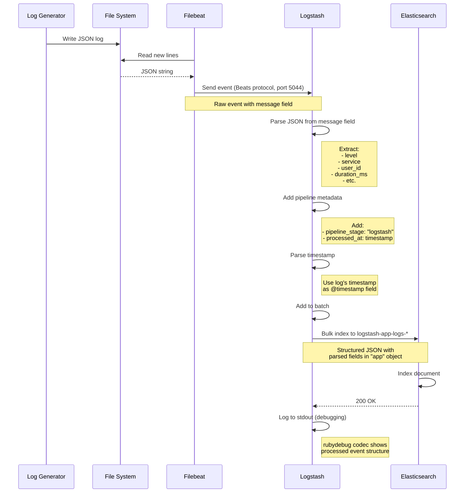

### Why This Change?

#### Problems Solved from Phase 2

1. **JSON Parsing**: Extract fields from JSON string
2. **Structured Data**: Make logs queryable by field
3. **Data Enrichment**: Add processing metadata
4. **Timestamp Handling**: Use log's timestamp instead of ingestion time
5. **Filtering & Transformation**: Apply business logic before indexing
6. **Multiple Outputs**: Can send to multiple destinations

### Implementation Changes

#### 1. Logstash Pipeline Configuration (`logstash/pipeline/logstash.conf`)

```ruby
input {
  beats {
    port => 5044
  }
}

filter {
  # Parse JSON from message field into "app" object
  json {
    source => "message"
    target => "app"
  }
  
  # Add pipeline tracking metadata
  mutate {
    add_field => {
      "pipeline_stage" => "logstash"
      "processed_at" => "%{@timestamp}"
    }
  }
  
  # Use log's timestamp as event timestamp
  date {
    match => ["[app][timestamp]", "ISO8601"]
    target => "@timestamp"
  }
}

output {
  # Send to Elasticsearch
  elasticsearch {
    hosts => ["elasticsearch:9200"]
    index => "logstash-app-logs-%{+YYYY.MM.dd}"
  }
  
  # Debug output to stdout
  stdout {
    codec => rubydebug
  }
}
```

#### Configuration Breakdown

| Section | Plugin | Purpose | Details |
|---------|--------|---------|---------|
| **Input** | `beats` | Receive from Filebeat | Listens on port 5044 for Beats protocol |
| **Filter** | `json` | Parse JSON string | Extracts fields from `message` into `app` object |
| **Filter** | `mutate` | Add metadata | Adds `pipeline_stage` and `processed_at` fields |
| **Filter** | `date` | Fix timestamp | Uses log's timestamp instead of ingestion time |
| **Output** | `elasticsearch` | Store data | Sends to ES with custom index pattern |
| **Output** | `stdout` | Debugging | Prints processed events to logs |

#### 2. Filebeat Configuration Changes

**Before (Phase 2):**
```yaml
output.elasticsearch:
  hosts: ["elasticsearch:9200"]
  index: "filebeat-app-logs-%{+yyyy.MM.dd}"
```

**After (Phase 3):**
```yaml
output.logstash:
  hosts: ["logstash:5044"]

# Removed: elasticsearch output
# Removed: index template settings
# Removed: decode_json_fields processor (handled by Logstash)
```

**Why?**
- Filebeat now sends raw events to Logstash
- Logstash handles all JSON parsing and transformations
- Cleaner separation of concerns

#### 3. Docker Compose Changes

```yaml
services:
  logstash:
    image: docker.elastic.co/logstash/logstash:8.19.0
    ports:
      - "5044:5044"  # Beats input
      - "9600:9600"  # Health check API
    volumes:
      - ./logstash/pipeline:/usr/share/logstash/pipeline:ro
    depends_on:
      elasticsearch:
        condition: service_healthy
    healthcheck:
      test: ["CMD-SHELL", "curl -f http://localhost:9600 || exit 1"]
      interval: 10s
      timeout: 5s
      retries: 5
  
  filebeat:
    depends_on:
      logstash:
        condition: service_healthy  # Changed from elasticsearch
```

### How Logstash Works

#### 1. Pipeline Architecture

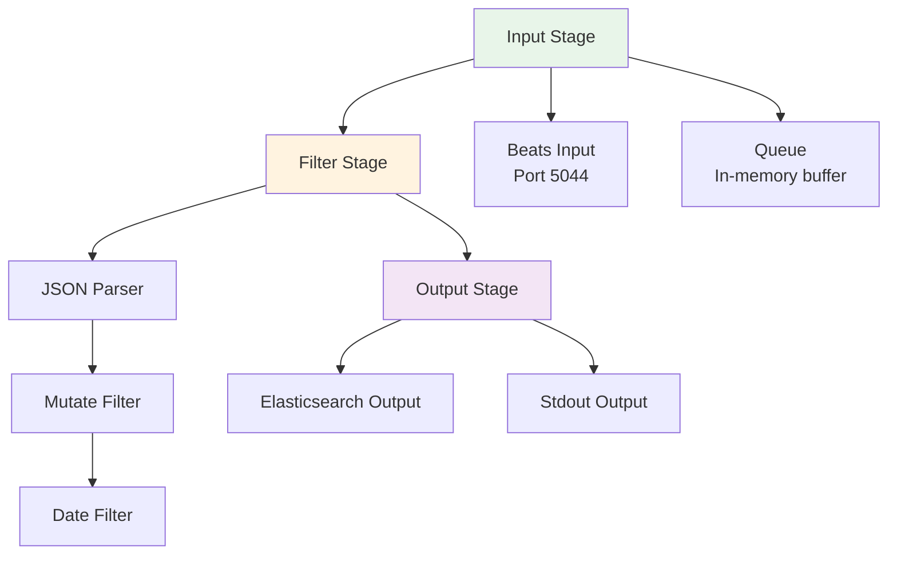

#### 2. Data Transformation Flow

**Input Event from Filebeat:**
```json
{
  "@timestamp": "2026-01-15T10:30:00.000Z",
  "message": "{\"timestamp\": \"2026-01-15T10:29:58.123456\", \"level\": \"ERROR\", \"service\": \"payment-service\", \"message\": \"Payment failed\", \"user_id\": \"user_1234\", \"request_id\": \"req_5678\", \"duration_ms\": 1250, \"status_code\": 500}",
  "host": { "name": "filebeat-container" },
  "agent": { "type": "filebeat", "version": "8.19.0" },
  "log": {
    "file": { "path": "/var/log/app/application.log", "offset": 12345 }
  }
}
```

**After JSON Filter:**
```json
{
  "@timestamp": "2026-01-15T10:30:00.000Z",
  "message": "{...}",  // Original JSON string preserved
  "app": {
    "timestamp": "2026-01-15T10:29:58.123456",
    "level": "ERROR",
    "service": "payment-service",
    "message": "Payment failed",
    "user_id": "user_1234",
    "request_id": "req_5678",
    "duration_ms": 1250,
    "status_code": 500
  },
  "host": {...},
  "agent": {...}
}
```

**After Mutate Filter:**
```json
{
  "@timestamp": "2026-01-15T10:30:00.000Z",
  "app": {...},
  "pipeline_stage": "logstash",
  "processed_at": "2026-01-15T10:30:00.000Z",
  ...
}
```

**After Date Filter (Final):**
```json
{
  "@timestamp": "2026-01-15T10:29:58.123Z",  // ← Changed to log's timestamp!
  "app": {
    "timestamp": "2026-01-15T10:29:58.123456",
    "level": "ERROR",
    "service": "payment-service",
    "message": "Payment failed",
    "user_id": "user_1234",
    "request_id": "req_5678",
    "duration_ms": 1250,
    "status_code": 500
  },
  "pipeline_stage": "logstash",
  "processed_at": "2026-01-15T10:30:00.000Z",
  "host": {...},
  "agent": {...},
  "log": {...}
}
```

#### 3. Logstash Performance Characteristics

| Metric | Value | Description |
|--------|-------|-------------|
| **Pipeline Workers** | CPU cores | Parallel processing threads |
| **Pipeline Batch Size** | 125 events | Events processed together |
| **Pipeline Batch Delay** | 50ms | Max wait before processing batch |
| **Queue Type** | Memory | In-memory queue (fast but non-persistent) |
| **Queue Max Events** | 1000 | Backpressure threshold |

**Processing Flow:**
```
Beats Input → Input Queue (1000 events) → Worker Thread 1 (batch 125) ┐
                                       ┌→ Worker Thread 2 (batch 125) ├→ Output Queue → Elasticsearch
                                       └→ Worker Thread N (batch 125) ┘
```

### Elasticsearch Index Structure

**Index Pattern:** `logstash-app-logs-2026.01.15`

**Document Structure (Parsed):**
```json
{
  "@timestamp": "2026-01-15T10:29:58.123Z",
  "@version": "1",
  "app": {
    "timestamp": "2026-01-15T10:29:58.123456",
    "level": "ERROR",
    "service": "payment-service",
    "message": "Payment failed",
    "user_id": "user_1234",
    "request_id": "req_5678",
    "duration_ms": 1250,
    "status_code": 500
  },
  "pipeline_stage": "logstash",
  "processed_at": "2026-01-15T10:30:00.000Z",
  "message": "{\"timestamp\": \"2026-01-15T10:29:58.123456\", ...}",
  "log_source": "filebeat",
  "host": {
    "name": "filebeat-container",
    "architecture": "aarch64"
  },
  "agent": {
    "type": "filebeat",
    "version": "8.19.0"
  },
  "log": {
    "file": {
      "path": "/var/log/app/application.log",
      "offset": 123456
    }
  }
}
```

### Query Examples

#### Phase 2 (Filebeat Only) - Limited Queries

```bash
# Can't easily filter by log level (it's inside message string)
curl -X GET 'http://localhost:9200/filebeat-app-logs-*/_search' -H 'Content-Type: application/json' -d'
{
  "query": {
    "match": {
      "message": "ERROR"  # Text search, not precise
    }
  }
}'
```

#### Phase 3 (Logstash) - Structured Queries

```bash
# Precise filtering by parsed fields
curl -X GET 'http://localhost:9200/logstash-app-logs-*/_search' -H 'Content-Type: application/json' -d'
{
  "query": {
    "term": {
      "app.level": "ERROR"  # Exact match on keyword field
    }
  }
}'

# Filter by service
curl -X GET 'http://localhost:9200/logstash-app-logs-*/_search' -H 'Content-Type: application/json' -d'
{
  "query": {
    "term": {
      "app.service.keyword": "payment-service"
    }
  }
}'

# Find slow requests (duration > 2000ms)
curl -X GET 'http://localhost:9200/logstash-app-logs-*/_search' -H 'Content-Type: application/json' -d'
{
  "query": {
    "range": {
      "app.duration_ms": {
        "gte": 2000
      }
    }
  },
  "sort": [{"app.duration_ms": "desc"}]
}'

# Complex query: ERROR logs from payment-service in last hour
curl -X GET 'http://localhost:9200/logstash-app-logs-*/_search' -H 'Content-Type: application/json' -d'
{
  "query": {
    "bool": {
      "must": [
        { "term": { "app.level": "ERROR" } },
        { "term": { "app.service.keyword": "payment-service" } }
      ],
      "filter": [
        { "range": { "@timestamp": { "gte": "now-1h" } } }
      ]
    }
  }
}'

# Aggregation: Average response time by service
curl -X GET 'http://localhost:9200/logstash-app-logs-*/_search' -H 'Content-Type: application/json' -d'
{
  "size": 0,
  "aggs": {
    "by_service": {
      "terms": {
        "field": "app.service.keyword"
      },
      "aggs": {
        "avg_duration": {
          "avg": {
            "field": "app.duration_ms"
          }
        }
      }
    }
  }
}'
```

### Advantages ✅

1. **Structured Data**: All fields queryable and filterable
2. **Data Transformation**: Parse, enrich, filter before indexing
3. **Correct Timestamps**: Use log's timestamp, not ingestion time
4. **Multiple Outputs**: Can send to Elasticsearch, S3, Kafka, etc.
5. **Powerful Filtering**: Drop unwanted logs, add conditions
6. **Data Enrichment**: Add GeoIP, user agent parsing, etc.
7. **Debugging**: Stdout output shows processed events
8. **Production Ready**: Industry-standard ELK stack

### Disadvantages ❌

1. **Complexity**: One more component to manage
2. **Resource Usage**: Logstash needs ~512MB RAM minimum
3. **Single Point of Failure**: If Logstash down, no logs indexed
4. **Learning Curve**: Logstash config syntax takes time to learn
5. **Latency**: Small additional delay (typically <100ms)

### When to Use

- **Production ELK Stack**: Full-featured logging pipeline
- **Complex Parsing**: Multiple log formats, grok patterns
- **Data Enrichment**: Add GeoIP, user lookup, etc.
- **Multiple Destinations**: Send to ES, S3, monitoring systems
- **Filtering Logic**: Drop debug logs in production
- **Compliance**: Need audit trail of data transformations

---

## Phase 4: Kafka Message Queue Integration

### Overview
Adding Apache Kafka as a distributed message queue between Filebeat and Logstash. This creates a highly scalable, fault-tolerant logging pipeline with buffering, replay capabilities, and decoupling of data producers from consumers.

### Architecture Diagram

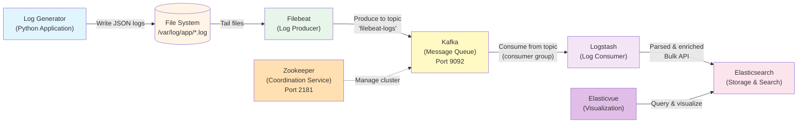

### Detailed Sequence Diagram

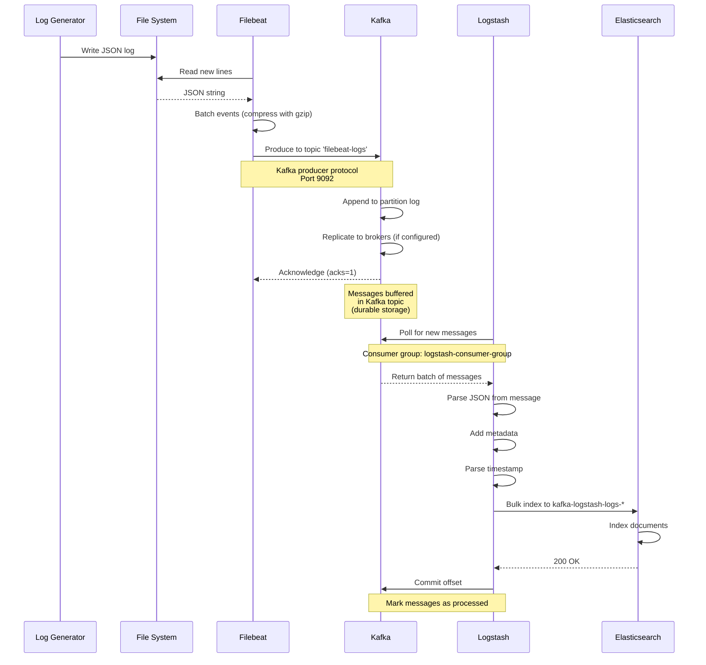

### Why This Change?

#### Problems Solved from Phase 3

1. **Backpressure Handling**: If Logstash is slow or down, Kafka buffers messages
2. **Scalability**: Multiple Filebeat instances can send to same Kafka topic
3. **Replay Capability**: Can reprocess logs by resetting consumer offsets
4. **Decoupling**: Filebeat and Logstash operate independently
5. **Multiple Consumers**: Multiple Logstash instances can consume in parallel
6. **Durability**: Messages persisted to disk, survive system failures
7. **Stream Processing**: Opens door to real-time analytics (Kafka Streams, Flink)

### Implementation Changes

#### 1. Docker Compose - Add Zookeeper and Kafka

**New Services Added:**

```yaml
zookeeper:
  image: wurstmeister/zookeeper:latest
  container_name: zookeeper
  ports:
    - "2181:2181"
  networks:
    - elk-network
  healthcheck:
    test: ["CMD-SHELL", "echo ruok | nc localhost 2181 || exit 1"]
    interval: 10s
    timeout: 5s
    retries: 10

kafka:
  image: wurstmeister/kafka:latest
  container_name: kafka
  ports:
    - "9092:9092"
  environment:
    KAFKA_ADVERTISED_HOST_NAME: kafka
    KAFKA_ADVERTISED_PORT: 9092
    KAFKA_ZOOKEEPER_CONNECT: zookeeper:2181
    KAFKA_CREATE_TOPICS: "filebeat-logs:1:1"
    KAFKA_AUTO_CREATE_TOPICS_ENABLE: "true"
  depends_on:
    zookeeper:
      condition: service_healthy
  healthcheck:
    test: ["CMD-SHELL", "kafka-broker-api-versions.sh --bootstrap-server localhost:9092 || exit 1"]
    interval: 10s
    timeout: 10s
    retries: 10
```

**Configuration Breakdown:**

| Component | Setting | Purpose |
|-----------|---------|---------|
| **Zookeeper** | Port 2181 | Coordination service for Kafka cluster |
| | Health check | `echo ruok` command verifies service |
| **Kafka** | Port 9092 | Broker port for producer/consumer connections |
| | `KAFKA_ADVERTISED_HOST_NAME` | Hostname for clients to connect |
| | `KAFKA_ZOOKEEPER_CONNECT` | Link to Zookeeper for cluster management |
| | `KAFKA_CREATE_TOPICS` | Auto-create topic: 1 partition, 1 replica |
| | Health check | Verify broker API availability |

**Dependency Chain:**
```
Zookeeper → Kafka → Filebeat (producer)
                  ↓
            Kafka → Logstash (consumer) → Elasticsearch
```

#### 2. Filebeat Configuration Changes

**Before (Phase 3):**
```yaml
output.logstash:
  hosts: ["logstash:5044"]
```

**After (Phase 4):**
```yaml
output.kafka:
  hosts: ["kafka:9092"]
  topic: "filebeat-logs"
  partition.round_robin:
    reachable_only: false
  required_acks: 1
  compression: gzip
  max_message_bytes: 1000000
```

**Configuration Breakdown:**

| Setting | Value | Purpose |
|---------|-------|---------|
| `hosts` | `kafka:9092` | Kafka broker addresses |
| `topic` | `filebeat-logs` | Target topic for log messages |
| `partition.round_robin` | `reachable_only: false` | Distribute across all partitions |
| `required_acks` | `1` | Wait for leader acknowledgment (balance speed/durability) |
| `compression` | `gzip` | Compress messages to save bandwidth |
| `max_message_bytes` | `1000000` | Max message size (1MB) |

**Acknowledgment Levels:**

| acks | Behavior | Speed | Durability |
|------|----------|-------|------------|
| `0` | No wait (fire and forget) | Fastest | Lowest (messages can be lost) |
| `1` | Wait for leader only | Fast | Medium (leader ack, no replica wait) |
| `all` | Wait for all replicas | Slowest | Highest (fully replicated) |

We use `acks=1` for good balance in development.

#### 3. Logstash Configuration Changes

**Before (Phase 3):**
```ruby
input {
  beats {
    port => 5044
  }
}
```

**After (Phase 4):**
```ruby
input {
  kafka {
    bootstrap_servers => "kafka:9092"
    topics => ["filebeat-logs"]
    codec => "json"
    consumer_threads => 1
    decorate_events => true
    group_id => "logstash-consumer-group"
  }
}

# Filter and output sections remain the same
# Output index changed to: kafka-logstash-logs-%{+YYYY.MM.dd}
```

**Configuration Breakdown:**

| Setting | Value | Purpose |
|---------|-------|---------|
| `bootstrap_servers` | `kafka:9092` | Initial Kafka broker(s) to connect |
| `topics` | `["filebeat-logs"]` | Topic(s) to consume from |
| `codec` | `json` | Message format decoder |
| `consumer_threads` | `1` | Number of consumer threads (scales with partitions) |
| `decorate_events` | `true` | Add Kafka metadata (@metadata fields) |
| `group_id` | `logstash-consumer-group` | Consumer group for offset management |

**Consumer Group Concept:**

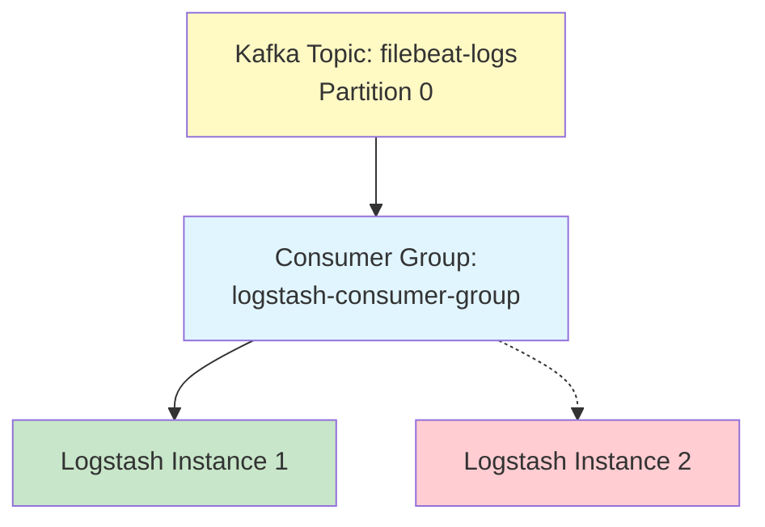

- **Consumer Group**: Multiple consumers share the load
- **Partition Assignment**: Each partition consumed by one consumer in group
- **Offset Tracking**: Kafka tracks what each group has consumed
- **Scalability**: Add more partitions and consumers to scale

### How Kafka Works in the Pipeline

#### 1. Kafka Architecture

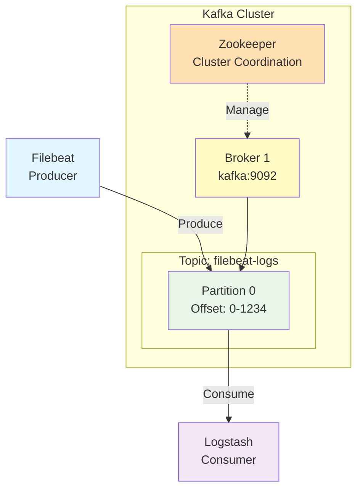

**Key Concepts:**

| Concept | Description |
|---------|-------------|
| **Broker** | Kafka server that stores and serves messages |
| **Topic** | Category/stream name (e.g., "filebeat-logs") |
| **Partition** | Ordered, immutable sequence of messages |
| **Offset** | Unique sequential ID for each message in partition |
| **Producer** | Client that publishes messages (Filebeat) |
| **Consumer** | Client that reads messages (Logstash) |
| **Consumer Group** | Group of consumers sharing consumption load |
| **Zookeeper** | Manages cluster metadata and leader election |

#### 2. Message Flow Through Kafka

**Step-by-Step:**

1. **Filebeat produces message:**
   ```
   Filebeat → Kafka Broker → Topic: filebeat-logs → Partition 0
   Message appended at offset 1234
   ```

2. **Kafka stores message:**
   ```
   Partition log file: /var/lib/kafka/data/filebeat-logs-0/00000000000000001234.log
   Message durably written to disk
   ```

3. **Logstash polls for messages:**
   ```
   Logstash → Kafka Broker: "Give me messages from offset 1230 onwards"
   Kafka → Logstash: Returns messages 1230-1234
   ```

4. **Logstash processes and commits:**
   ```
   Logstash processes messages → Sends to Elasticsearch
   Logstash → Kafka: "Commit offset 1234" (mark as consumed)
   ```

#### 3. Offset Management

**Offset Tracking:**

```
Consumer Group: logstash-consumer-group
Topic: filebeat-logs
Partition 0: Last committed offset = 1234

Next poll starts from offset 1235
```

**Benefits:**

- **Resume from failure**: If Logstash crashes, restarts from last committed offset
- **No duplicate processing**: (in ideal case) each message processed once
- **Replay capability**: Can reset offset to reprocess old messages

**Offset Reset Strategies:**

| Strategy | Behavior |
|----------|----------|
| `earliest` | Start from beginning of topic |
| `latest` | Start from newest messages only |
| `none` | Fail if no offset found |

#### 4. Kafka Data Retention

```yaml
# Kafka broker configuration
log.retention.hours: 168  # 7 days (default)
log.retention.bytes: -1   # No size limit
log.segment.bytes: 1073741824  # 1GB segments
```

**Retention Policies:**

- Messages kept for 7 days by default
- After 7 days, old segments deleted
- Allows replay of logs up to 7 days old
- Can configure per-topic retention

### Data Flow Comparison

| Aspect | Phase 3 (Direct Logstash) | Phase 4 (Kafka Queue) |
|--------|---------------------------|------------------------|
| **Producer** | Filebeat → Logstash:5044 | Filebeat → Kafka:9092 |
| **Protocol** | Beats protocol | Kafka protocol |
| **Buffering** | Limited (in-memory) | Disk-based (durable) |
| **Failure Mode** | Filebeat retries, blocks | Messages buffered in Kafka |
| **Backpressure** | Filebeat slows down | Kafka absorbs spike |
| **Replay** | ❌ Not possible | ✅ Reset offset to replay |
| **Scalability** | 1:1 (Filebeat:Logstash) | N:M (many producers, many consumers) |
| **Latency** | ~100ms | ~200ms (extra hop) |
| **Durability** | ⚠️ Memory only | ✅ Disk persistence |

### Performance Characteristics

#### Throughput Test Results

| Metric | Value | Notes |
|--------|-------|-------|
| **Messages/Second** | ~10,000 | Single partition, single consumer |
| **Batching Size** | 50-100 messages | Filebeat batching |
| **Compression Ratio** | ~5:1 | gzip compression |
| **Average Latency** | 200ms | End-to-end (Filebeat → Elasticsearch) |
| **Kafka Disk Usage** | ~10MB/hour | With 7-day retention |

### Real-World Scenarios

#### Scenario 1: Logstash Downtime

**Without Kafka (Phase 3):**
```
08:00 - Logstash crashes
08:00-09:00 - Logs accumulate in files
09:00 - Logstash restarted
09:00-09:30 - Filebeat catches up (reprocesses from file offset)
Result: 30 minutes lag, file disk space risk
```

**With Kafka (Phase 4):**
```
08:00 - Logstash crashes
08:00-09:00 - Logs continue flowing to Kafka (buffered)
09:00 - Logstash restarted
09:00-09:05 - Logstash catches up (reads from Kafka offset)
Result: 5 minutes lag, no data loss, predictable recovery
```

#### Scenario 2: Traffic Spike

**Without Kafka:**
```
Peak traffic → Filebeat sends faster → Logstash overwhelmed
→ Filebeat blocks → Application affected (slow log writes)
```

**With Kafka:**
```
Peak traffic → Filebeat sends to Kafka (fast) → Kafka buffers
→ Logstash consumes at its own pace → No backpressure to application
```

#### Scenario 3: Scaling Horizontally

**With Kafka:**
```
1 Kafka topic with 3 partitions
├── Partition 0 → Logstash Instance 1
├── Partition 1 → Logstash Instance 2
└── Partition 2 → Logstash Instance 3

Throughput: 30,000 messages/second (10k per instance)
```

### Elasticsearch Index Structure

**Index Pattern:** `kafka-logstash-logs-2026.01.15`

**Document Structure:**
```json
{
  "@timestamp": "2026-01-15T08:47:13.973Z",
  "@version": "1",
  "app": {
    "timestamp": "2026-01-15T08:47:13.456789",
    "level": "DEBUG",
    "service": "notification-service",
    "message": "API request received",
    "user_id": "user_1234",
    "request_id": "req_5678",
    "duration_ms": 245,
    "status_code": 200
  },
  "pipeline_stage": "logstash",
  "processed_at": "2026-01-15T08:47:14.100Z",
  "log_source": "filebeat",
  "host": {...},
  "agent": {...},
  "log": {...},
  "@metadata": {
    "kafka": {
      "topic": "filebeat-logs",
      "partition": 0,
      "offset": 1234,
      "timestamp": 1736930833973
    }
  }
}
```

**New Kafka Metadata Fields:**

| Field | Description |
|-------|-------------|
| `@metadata.kafka.topic` | Source Kafka topic |
| `@metadata.kafka.partition` | Partition number |
| `@metadata.kafka.offset` | Message offset in partition |
| `@metadata.kafka.timestamp` | Kafka message timestamp |

### Monitoring Kafka

#### Check Kafka Topics

```bash
# List topics
podman exec kafka kafka-topics.sh --list --bootstrap-server localhost:9092

# Describe topic
podman exec kafka kafka-topics.sh --describe --topic filebeat-logs --bootstrap-server localhost:9092
```

**Output:**
```
Topic: filebeat-logs    PartitionCount: 1    ReplicationFactor: 1
Topic: filebeat-logs    Partition: 0    Leader: 1001    Replicas: 1001    Isr: 1001
```

#### Check Consumer Groups

```bash
# List consumer groups
podman exec kafka kafka-consumer-groups.sh --list --bootstrap-server localhost:9092

# Describe consumer group (shows lag)
podman exec kafka kafka-consumer-groups.sh --describe --group logstash-consumer-group --bootstrap-server localhost:9092
```

**Output:**
```
GROUP                    TOPIC           PARTITION  CURRENT-OFFSET  LOG-END-OFFSET  LAG
logstash-consumer-group  filebeat-logs   0          1234            1234            0
```

**Metrics:**
- **CURRENT-OFFSET**: Last offset committed by consumer
- **LOG-END-OFFSET**: Latest offset in partition
- **LAG**: Messages waiting to be processed (should be close to 0)

#### Monitor Message Flow

```bash
# View Kafka logs
podman logs kafka 2>&1 | tail -20

# View messages in topic (console consumer)
podman exec kafka kafka-console-consumer.sh \
  --bootstrap-server localhost:9092 \
  --topic filebeat-logs \
  --from-beginning \
  --max-messages 5
```

### Advantages ✅

1. **Durability**: Messages persisted to disk, survive crashes
2. **Scalability**: Horizontal scaling with partitions and consumers
3. **Decoupling**: Producers and consumers operate independently
4. **Backpressure Handling**: Kafka buffers during slowdowns
5. **Replay Capability**: Reprocess logs by resetting offsets
6. **Multiple Consumers**: Different pipelines consume same data
7. **High Throughput**: Handles 10,000+ messages/second
8. **Fault Tolerance**: Replication (when configured with multiple brokers)
9. **Stream Processing**: Enables real-time analytics

### Disadvantages ❌

1. **Complexity**: Two more components (Zookeeper + Kafka)
2. **Resource Usage**: Kafka needs ~1GB RAM, disk for buffering
3. **Latency**: Additional ~100ms latency (extra hop)
4. **Operational Overhead**: More services to monitor and manage
5. **Learning Curve**: Understanding topics, partitions, offsets
6. **Disk Usage**: Messages stored for retention period (default 7 days)

### When to Use

- **High Volume**: >10,000 logs per second
- **Multiple Consumers**: Need to send logs to multiple destinations
- **Replay Requirements**: Need to reprocess historical logs
- **Decoupling**: Want independent scaling of producers/consumers
- **Durability**: Cannot afford to lose logs during outages
- **Stream Processing**: Planning to add Kafka Streams or Flink
- **Enterprise**: Large-scale distributed systems

---

## Comparison Matrix

### Feature Comparison

| Feature | Phase 1 (Direct) | Phase 2 (Filebeat) | Phase 3 (Logstash) | Phase 4 (Kafka) |
|---------|------------------|--------------------|--------------------|-----------------|
| **Components** | 2 (App + ES) | 3 (App + FB + ES) | 5 (App + FB + LS + ES + UI) | 7 (App + FB + ZK + Kafka + LS + ES + UI) |
| **Latency** | <10ms | ~1s (batching) | ~2s (batching + processing) | ~3s (batching + queue + processing) |
| **Structured Data** | ✅ Yes | ❌ No (string) | ✅ Yes (parsed) | ✅ Yes (parsed) |
| **Queryable Fields** | ✅ All fields | ❌ Full-text only | ✅ All parsed fields | ✅ All parsed fields |
| **Resilience** | ❌ Low | ✅ Medium | ✅ High | ✅ Very High |
| **Buffering** | ❌ None | ✅ File-based | ✅ File + Queue | ✅ File + Kafka (disk) |
| **Data Enrichment** | ❌ None | ⚠️ Limited | ✅ Full | ✅ Full |
| **Transformation** | ❌ None | ⚠️ Basic | ✅ Advanced | ✅ Advanced |
| **Filtering** | ❌ No | ⚠️ Limited | ✅ Full | ✅ Full |
| **Multiple Outputs** | ❌ No | ❌ No | ✅ Yes | ✅ Yes (multiple consumers) |
| **Replay Capability** | ❌ No | ❌ No | ❌ No | ✅ Yes (offset reset) |
| **Horizontal Scaling** | ❌ No | ⚠️ Limited | ⚠️ Limited | ✅ Yes (partitions) |
| **Resource Usage** | Low | Low | Medium-High | High |
| **Complexity** | Low | Medium | High | Very High |
| **Setup Time** | 5 min | 15 min | 30 min | 45 min |
| **Production Ready** | ❌ No | ⚠️ Basic | ✅ Yes | ✅ Enterprise |

### Performance Comparison

| Metric | Phase 1 | Phase 2 | Phase 3 | Phase 4 (Kafka) |
|--------|---------|---------|---------|-----------------|
| **Logs/Second** | ~100 | ~1,000 | ~5,000+ | ~10,000+ |
| **Network Requests/Min** | 6,000 | ~20 | ~50 | ~100 |
| **CPU Usage (App)** | Medium | Low | Low | Low |
| **Memory Usage** | ~256MB | ~512MB | ~1.5GB | ~3GB |
| **Disk I/O** | None | Medium | Medium | High (Kafka logs) |
| **Data Loss Risk** | High | Low | Very Low | Minimal (durable) |
| **Recovery Time** | N/A | 10-30 min | 5-10 min | 1-5 min |
| **Disk I/O** | None | Medium | Medium |
| **Data Loss Risk** | High | Low | Very Low |

### Use Case Recommendations

| Scenario | Recommended Phase | Reason |
|----------|-------------------|--------|
| Local Development | Phase 1 | Simplicity, fast setup |
| Testing/Staging | Phase 2 | Good balance, realistic |
| Production (Small) | Phase 2 or 3 | Reliable, cost-effective |
| Production (Medium) | Phase 3 | Full features, manageable complexity |
| Production (Enterprise) | Phase 4 | Maximum reliability, scalability |
| High Volume (>10k logs/s) | Phase 4 | Kafka designed for high throughput |
| Complex Log Formats | Phase 3 or 4 | Logstash parsing capabilities |
| Multiple Data Sources | Phase 3 or 4 | Unified pipeline |
| Multiple Destinations | Phase 4 | Kafka allows multiple consumers |
| Replay Requirements | Phase 4 | Only Kafka supports offset reset |
| Compliance Requirements | Phase 3 or 4 | Audit trail, filtering |
| Microservices Architecture | Phase 4 | Decoupling, independent scaling |

---

## Best Practices & Lessons Learned

### 1. JSON Parsing Strategy

#### ❌ Don't Parse in Filebeat
```yaml
# Avoid this - limited capabilities
processors:
  - decode_json_fields:
      fields: ["message"]
      target: "app"
```

#### ✅ Parse in Logstash
```ruby
# Better - full transformation power
filter {
  json {
    source => "message"
    target => "app"
  }
  # Can add more complex logic here
}
```

**Why?** Logstash has more powerful parsing, error handling, and transformation capabilities.

### 2. Timestamp Handling

Always use the log's original timestamp, not ingestion time:

```ruby
filter {
  date {
    match => ["[app][timestamp]", "ISO8601"]
    target => "@timestamp"
  }
}
```

**Benefit:** Accurate time-series analysis, correct event ordering.

### 3. Index Patterns

Use date-based index patterns:

```ruby
output {
  elasticsearch {
    index => "logstash-app-logs-%{+YYYY.MM.dd}"
  }
}
```

**Benefits:**
- Easy to delete old data
- Improved query performance
- Simplified backup/restore

### 4. Health Checks

Always configure proper health checks:

```yaml
healthcheck:
  test: ["CMD-SHELL", "curl -f http://localhost:9600 || exit 1"]
  interval: 10s
  timeout: 5s
  retries: 5
```

**Benefit:** Proper service startup order, automatic recovery.

### 5. Volume Management

Persist important data:

```yaml
volumes:
  - filebeat-data:/usr/share/filebeat/data  # Registry
  - elasticsearch-data:/usr/share/elasticsearch/data  # Indices
```

**Why?** Prevents data loss and duplicate processing on restarts.

### 6. Debugging Pipeline

Enable stdout output during development:

```ruby
output {
  elasticsearch { ... }
  stdout { codec => rubydebug }  # See processed events
}
```

View with: `podman logs -f logstash`

### 7. Error Handling

Monitor Filebeat and Logstash logs regularly:

```bash
# Check for errors
podman logs filebeat | grep -i error
podman logs logstash | grep -i error

# Verify data flow
podman logs logstash | grep "Beats inputs"
curl 'http://localhost:9200/logstash-app-logs-*/_count'
```

### 8. Resource Allocation

Minimum recommended resources:

| Service | CPU | Memory | Disk | Notes |
|---------|-----|--------|------|-------|
| Elasticsearch | 2 cores | 2GB | 50GB | Scales with data volume |
| Logstash | 2 cores | 1GB | 5GB | Scales with throughput |
| Filebeat | 0.5 core | 128MB | 1GB | Lightweight |
| Kafka | 2 cores | 1GB | 20GB | For 7-day retention |
| Zookeeper | 1 core | 512MB | 5GB | Cluster coordination |

### 9. Common Pitfalls

| Issue | Cause | Solution |
|-------|-------|----------|
| JSON not parsed | Wrong field name | Verify `source => "message"` |
| Duplicate logs | Registry not persisted | Use volume for filebeat-data |
| Lost logs | No buffering | Use Filebeat + Logstash + Kafka |
| Slow queries | No field parsing | Implement Logstash parsing |
| Disk full | No log rotation | Implement log rotation or ILM |
| Kafka lag growing | Consumer too slow | Add more partitions + consumers |
| Zookeeper connection issues | Network or timing | Check Zookeeper health, increase timeout |
| Messages not in Kafka | Topic doesn't exist | Enable auto-create or create manually |

---

## Conclusion

The evolution from direct Elasticsearch integration to a Kafka-based distributed logging pipeline demonstrates the progression from simplicity to enterprise-grade reliability:

- **Phase 1** is perfect for quick prototypes and learning
- **Phase 2** adds reliability and decoupling for basic production use
- **Phase 3** provides the full power of the ELK stack for enterprise deployments
- **Phase 4** adds Kafka for maximum scalability, durability, and flexibility

Choose the phase that matches your requirements:
- **Start simple** (Phase 1-2) for development and small applications
- **Add Logstash** (Phase 3) when you need parsing and transformation
- **Add Kafka** (Phase 4) when you need high throughput, replay, or multiple consumers

Remember: **Each phase builds on the previous one**. You can migrate incrementally as your needs grow.
